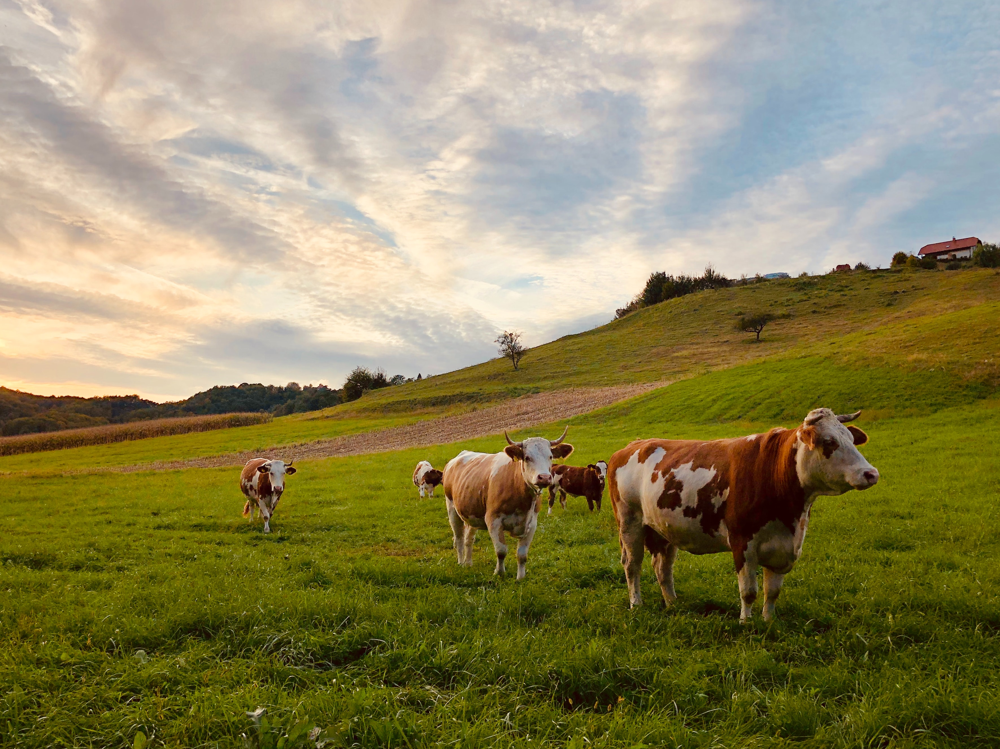
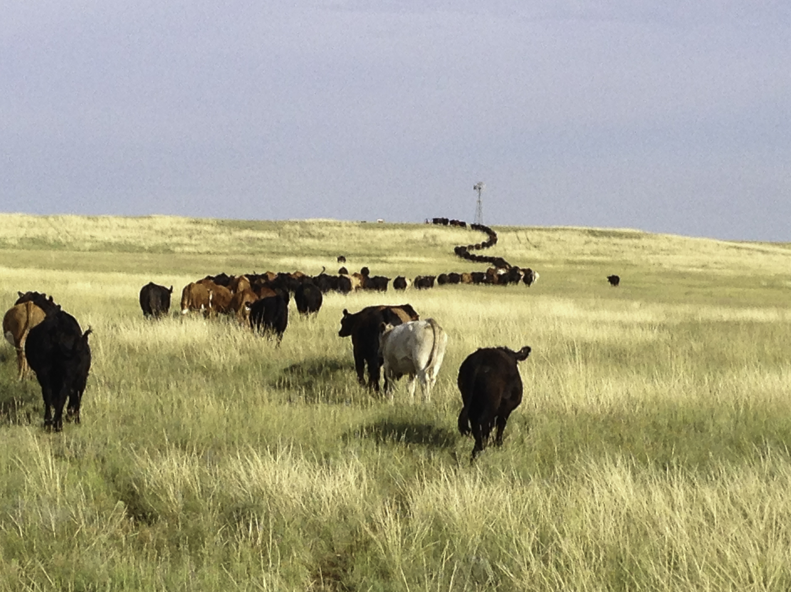

<style>
body {
text-align: justify;
font-size: 12pt;}
caption {
      color: black;
      font-weight: bold;
      font-size: 1.0em;
    }
</style>


```{r setup, include = FALSE}
knitr::opts_chunk$set(echo = TRUE, error = TRUE, warning= FALSE, message = FALSE, global.true=TRUE,
                      comment = '', fig.width = 15, fig.height = 10, out.width='750px' , fig.align='center')
```

```{r klippy, echo=FALSE, include=TRUE}
#remotes::install_github("rlesur/klippy")
klippy::klippy(position = c('top', 'right'))
```


* This is a data wrangling project which aims to provide facts and figures of U.S. Beef industry using relevant R packages.

* Packages are employed to clean, modify, arrange, visualize, and map the data with the most widely used functions and techniques in the packages.

* You will become familiar with beef industry's data and figures related to beef cattle inventory, beef production, international beef trade, prices, and consumption. Database covers the period from 1920 to 2022.

* Tables provided in the project are mini databases, and you can search,sort, and filter columns to get data for year, country, state, and county of your interest.

# Packages Required

This project aims to provide facts and figures of U.S. beef industry with R data wrangling, visualization and mapping functions and techniques.

* The most common functions in  ***tidyverse***, ***data.table***, ***ggplot2***, and ***usmap*** packages are employed. 
* The packages ***knitr*** and ***DT*** are used to provide customized plots, images and tables for R markdown output. 
* Animated plots and maps are produced with the packages ***gganimate***, ***gifski*** and ***png***. 

```{r packages}
#install.packages("...")
#data wrangling
library(tidyverse)
library(dtplyr)
library(tidyfast)
library(data.table)
#plots
library(ggplot2)
library(ggrepel)
library(cowplot)
library(lubridate)
#R interface/JavaScript-DataTables
library(knitr)
library(DT)
#load excel files
library(readxl)
#animated  plots
library(png)
library(gifski)
library(gganimate)
#mapping
library(usmap)
#rmarkdown
library(knitr)
#USDA data with API
library(tidyUSDA)
```

```{r}
#plot theme settings
plot_theme = theme(
  plot.title = element_text(face="bold", size = 20),
  axis.title.x = element_text(face="bold", size = 16),
  axis.text.x = element_text(face="bold",size = 14),
  axis.title.y = element_text(face="bold",size = 16),
  axis.text.y = element_text(face="bold",size = 14),
  strip.text.x = element_text(size=rel(3.5)),
  strip.text.y = element_text(size=rel(3.5)),
  legend.title = element_text(face="bold",size=16),
  legend.text = element_text(face="bold",size=14),
  )
```

# 1. Introduction

United States is the largest producer and consumer of beef in the world with 20% of the global beef production. [<a href="https://www.fas.usda.gov/data/livestock-and-poultry-world-markets-and-trade" target="_blank">Source</a>] 

The main stages of beef-cattle production process in U.S. are cow-calf operations, stocker/backgrounding operations, feedlots, meat packers and processors, and retailers. The production process begins with the cow-calf farms where cows and calves are raised. The next stage of production occurs at stocker/backgrounding operations where calves are placed on grass or other type of roughage. Feedlots are the final chain in the cattle production and they feed cattle with different rations of grain, silage, and/or protein supplements and sell to beef packers and processors where beef and beef by-products are produced and sold to retailers. [<a href="https://www.ers.usda.gov/topics/animal-products/cattle-beef/sector-at-a-glance/" target="_blank">Source</a>] 

The economic size of beef-cattle industry including direct and indirect economic contributions during on-farm and post-farm activities is estimated as $167 billion in 2016. [<a href="chrome-extension://efaidnbmnnnibpcajpcglclefindmkaj/viewer.html?pdfurl=https%3A%2F%2Fcpb-us-e1.wpmucdn.com%2Fwordpressua.uark.edu%2Fdist%2F9%2F350%2Ffiles%2F2017%2F05%2F5-Popp-English_Economic-Contributions-of-the-US-Beef-Industry.pdf&clen=2351266&chunk=true" target="_blank">Source</a>] 

This project presents facts and figures of the industry with 4 main variables: production, international trade, price, and consumption. Production, international trade, and price sections include both cattle and beef sectors' data. Consumption figures are per capita values and beef is compared with pork and chicken per capita consumption.


# 2. Data

## 2.1. Data Sources
<a href="https://quickstats.nass.usda.gov/" target="_blank">USDA National Agricultural Statistics Service</a> database is the data source of the project, unless stated otherwise.

## 2.2. Data Import

All data used in the project is provided at <a href="https://github.com/ErdalErol/US-Beef-Industry" target="_blank">github</a> repository of the project.

### 2.2.1. Production
<p>&nbsp;</p>
#### **Cattle**

Beef cow inventory data is used for cattle production section. National, state and county level data is obtained for years available in the database. 

* U.S. Beef Cattle Inventory: 1920-2022, January 1 Inventory Value of the Year.
```{r}
cattleinv_data_yearly =  read_csv("data/beef_cattle_inv_yearly.csv")
```

* U.S. Beef Cattle Inventory by States: 1920-2022, January 1 Inventory Value of the Year.
```{r}
cattleinv_data_state_year =  read_csv("data/beef_cattle_inv_state_year.csv")
```

* U.S. Beef Cattle Inventory by Counties: 2021, January 1.
```{r}
cattleinv_data_county =  read_csv("data/beef_cattle_inv_county_2021.csv")
```
<p>&nbsp;</p>
#### **Beef**

Beef production values are yearly production amount (million pounds). 

* U.S. Beef Production: 1970-2021.
```{r}
beef_prod_data = read_excel("data/yearly beef production.xlsx")
```


### 2.2.2. International Trade 

Trade data is in quantities by partner countries across years. 
<p>&nbsp;</p>
#### **Cattle**

* Export 

  + U.S. Cattle Exports: 1989-2021.
```{r}
export_data_cattle = read_excel("data/cattle_trade.xlsx", sheet = "export")
```

* Import 

  + U.S. Cattle Imports: 1989-2021.
```{r}
import_data_cattle = read_excel("data/cattle_trade.xlsx", sheet = "import")
```
<p>&nbsp;</p>
#### **Beef**

* Export

  + U.S. Beef Exports: 1989-2021.  
```{r}
export_data = read_excel("data/beef_trade.xlsx", sheet = "export")
```

* Import
  
  + U.S. Beef Imports: 1989-2021.  
```{r}
import_data = read_excel("data/beef_trade.xlsx", sheet = "import")
```


### 2.2.3. Prices
<p>&nbsp;</p>
#### **Cattle**

Cattle prices are monthly 'prices received' values for beef cattle, calves, cows and steers and heifers.  All prices are dollars per cwt (hundred pounds of weight). 

* U.S. Cattle Prices: 2012-2021.
```{r}
cattle_price_data = read_excel("data/feedercattle_prices.xlsx")
```
<p>&nbsp;</p>
#### **Beef**

Beef price data covers monthly farm, wholesale, and retail prices. All prices are in cents per pound. 

* U.S. Beef Prices: 1970-2021.
```{r}
beef_price_data = read_excel("data/beef_prices.xlsx")
```


### 2.2.4. Consumption

Consumption data is in per capita values. 

* U.S. Meat Consumption: 1909-2019.
```{r}
beef_consmptn_data = read_excel("data/beef_consumption.xls")
```


# 3. Beef Industry


## 3.1. Production

### 3.1.1. Cattle
<p>&nbsp;</p>
#### **National Level**

***Table 1*** shows U.S. beef cattle inventory. There were 30.1 million head of beef cows in U.S. as of January 1, 2022. 

The number is 2.3% below from 2021. It has been decreasing since 2019. 

```{r}
table_data = as.data.table(cattleinv_data_yearly)
table_data %>%
  .[, Value:=Value/1000]%>%
  .[, pct_change := (Value/lead(Value) - 1)]%>%
  datatable(table_data,caption = htmltools::tags$caption(
    style = 'caption-side: top; text-align: center;', ('Table 1: U.S. Beef Cattle Inventory: 1920-2022')
  ), colnames = c('Year', '# of Heads-1000', 'Annual Change'))%>%
  formatCurrency('Value',currency = "", interval = 3, mark = ",", digits = 0)%>%
  formatPercentage('pct_change', 1)
```

Average beef cattle inventory numbers are;

* 30.5 million for 2013-2022
* 31.3 million for 2003-2022
* 32.2 million for 1993-2022.


```{r}
table_data[,mean(Value[1:10])][]
table_data[,mean(Value[1:20])][]
table_data[,mean(Value[1:30])][]
```

The maximum value was 45.7 million on January 1, 1975 and the lowest number was 8.9 million on January 1, 1928 (*Sort and Search options can be used to filter table and sort data.*). 
<p>&nbsp;</p>
<center>
<a href="https://unsplash.com/photos/1AKuVmQxUkU" target="_blank">{width=75%}<figcaption align="bottom"></a>Photo by David Dolenc</a></center>
<p>&nbsp;</p>

As we see from ***Figure 1***, beef cattle inventory has a decreasing trend since 1975 [<a href="https://www.beefmagazine.com/beef/beef-cattle-numbers-continue-decline" target="_blank">Source: An Article by Dr. Kenny Burdine (University of Kentucky) </a>]. However, average values imply that U.S beef cattle inventory has been relatively stable over last 30 years.

```{r}
table_data[,pct_change := (Value/lead(Value) - 1)*100]
table_data = as.data.frame(table_data)

g1 = ggplot(table_data, aes(x = Year, y = Value)) + 
  labs(title = "Figure 1-a) U.S. Beef Cattle Inventory-1000 heads") +
  geom_line(color="orange") +
  theme_bw()+
  plot_theme+
  annotate(
    geom = "curve", x = 1965, y = 43500, xend = 1975, yend = 45500, 
    curvature = -.3, arrow = arrow(length = unit(3, "mm")) )+
  annotate("text", y = 43000, x = 1950, label = "max: ~45.7 milion in 1975", size =5, angle = 0, color = "red")


g2 = ggplot(table_data, aes(x = Year, y = `pct_change`)) + 
  labs(title = "Figure 1-b) U.S. Beef Cattle Inventory-% change") +
  geom_line(color="orange") +
  theme_bw()+
  plot_theme

plot_grid(g1, g2)
```
<p>&nbsp;</p>
#### **State Level**

***Table 2*** provides inventory data for 50 states.  

You can check for each state's inventory number by filtering and sorting data.

```{r}
table_data = as.data.table(cattleinv_data_state_year)
table_data %>%
  .[order(-Year)]%>% 
  .[, Value:=Value/1000]%>%
  .[, c("Year", "State","Value")] %>%
  datatable(table_data,caption = htmltools::tags$caption(
    style = 'caption-side: top; text-align: center;', ('Table 2: U.S. Beef Cattle Inventory by State: 1920-2022')
  ), colnames = c('Year', 'State', 'Value-1000 heads'))%>%
  formatCurrency('Value',currency = "", interval = 3, mark = ",", digits=0)

```

The output of below code chunk tells that **Texas** has been the state with the highest beef cattle inventory since 1919. 

```{r}
table_data = as.data.table(cattleinv_data_state_year)
table_data = table_data %>%
  .[, c("Year", "State", "Value")] %>%
  .[order(-Value)]%>% 
  .[, Value:=Value/1000]%>%
  .[Year==2022] %>%
  .[, state_share := (Value*100/sum(Value))]%>%
  .[, c("Year","State","Value", "state_share")]

distinct(table_data[table_data[, .I[Value == max(Value)], by=Year]$V1], State)
```
<p>&nbsp;</p>
<center>
<a href="https://unsplash.com/photos/l5iHZwil9m4" target="_blank">{width=50%}<figcaption align = "bottom"></a>Photo by Daniel Lloyd Blunk-Fernández</a></center>
<p>&nbsp;</p>

On January 1, 2022, Texas had 4.48 million beef cows. Its share was 14.9%. 

The other states with the highest number of beef cows are Oklahoma, Missouri, Nebraska, and South Dakota.

Seven states have more than 1 million beef cows in 2022 with a total share of 48.83%. 

```{r}
table_data[,sum(state_share[1:7])][]
```
<p>&nbsp;</p>
<center>
<a href="https://www.ars.usda.gov/oc/images/photos/oct17/d3858-1/" target="_blank">{width=50%}<figcaption align = "bottom"></a>Photo by David Augustine</a></center>
<p>&nbsp;</p>
```{r}
table_data %>%
  .[, c("State", "Value", "state_share")] %>%
  .[, state_share := state_share/100]%>%
  datatable(table_data,caption = htmltools::tags$caption(
    style = 'caption-side: top; text-align: center;', ('Table 3: U.S. Beef Cattle Inventory by State: 2022')
  ), colnames = c('State', '# of Heads-1000', 'State Share'))%>%
  formatCurrency('Value',currency = "", interval = 3, mark = ",", digits = 0)%>%
  formatPercentage('state_share', 1)

```

***Figure 2*** provides a map of U.S. states with their beef cow inventory on January 1, 2022.

```{r}
state_map_data =table_data %>%
  .[, c("State", "Value")] %>%
  .[order(-Value)]

setnames(state_map_data,"State","state")

g1 = 
  plot_usmap(data = state_map_data, values = "Value", labels = TRUE,  color = "black")  + 
  scale_fill_continuous(name = "Beef Cattle Inventory",  low = "white", high = "red", label = scales::comma) + 
  labs(title = "Figure 2: U.S. Beef Cattle Inventory by State, 2022-1000 heads") +
  theme(plot.title = element_text(face="bold",size=20), legend.position = "right",  
        legend.title = element_text(face="bold",size=15), legend.text = element_text(size=12))

# Set label font size
g1$layers[[2]]$aes_params$size =5

g1

```

***Figure 3*** is an animated map of U.S. states that shows the change between 1972-2022.

```{r}
table_data = as.data.table(cattleinv_data_state_year)
animated_map_data = table_data %>%
  .[, c("Year", "State", "Value")] %>%
  .[, Value:=Value/1000]%>%
  .[Year> 1972]
  
  
setnames(animated_map_data,  "State", "state")

plot =
  plot_usmap(data = animated_map_data, values = "Value", labels = FALSE)  +
  scale_fill_continuous(name = "Beef Cattle Inventory",  low = "white", high = "purple", label = scales::comma) +
  labs(title = "Figure 3: Kentucky Beef Cattle Inventory by State 1972-2022", subtitle = 'Year: {closest_state}')+
  theme(plot.title = element_text(face="bold",size=20), legend.position = "right", plot.subtitle = element_text(face="bold",size=16),
        legend.title = element_text(face="bold",size=15), legend.text = element_text(size=12))+
   transition_states(Year)

animate(plot, fps = 5)
```

<p>&nbsp;</p>
#### **County Level**

***Table 4*** presents beef inventory across counties on January 1, 2021. 

Holt County in Nebraska has the highest number of beef cows.

It is followed by Okeechobee-Florida, Lincoln-Nebraska, Meade-South Dakota, and Fergus-Montana. 

You are welcomed to search your county's rank and numbers using Search filter.


```{r}
table_data = as.data.table(cattleinv_data_county)
table_data %>%
  .[order(-Value)] %>%
  .[, c("State", "County","Value")] %>%
  .[, county_share := (Value/sum(Value, na.rm=TRUE))]%>%
  .[, c("State", "County","Value", "county_share")] %>%
  datatable(table_data,caption = htmltools::tags$caption(
    style = 'caption-side: top; text-align: center;', ('Table 4: U.S. Beef Cattle Inventory by County- January 1, 2021')
  ), colnames = c('State','County','# of Heads', 'County Share'))%>%
  formatCurrency('Value',currency = "", interval = 3, mark = ",", digits = 0)%>%
  formatPercentage('county_share', 2)

```
<p>&nbsp;</p>
#### **Kentucky** 

Kentucky is the 8^th^ largest state in beef cattle inventory (January 1, 2022- ***Table 3 and 4***).
<p>&nbsp;</p>
<center>
<a href="https://pixabay.com/photos/theatre-building-sign-kentucky-2703064/" target="_blank">{width=50%}<figcaption align="bottom"></a>Photo by Danehrr22</a></center>
<p>&nbsp;</p>

As the largest cattle producing state east of the Mississippi River, Kentucky has about 966 thousand heads of beef cattle. The number is 0.7% below from 2021. 

```{r}
table_data = as.data.table(cattleinv_data_state_year)
table_data %>%
  .[, c("Year", "State", "Value")] %>%
  .[, Value:=Value/1000]%>%
   .[State=="KENTUCKY"] %>%
  .[, c("Year","Value")] %>%
  .[, pct_change := (Value/lead(Value) - 1)]%>%
  datatable(table_data,caption = htmltools::tags$caption(
    style = 'caption-side: top; text-align: center;', ('Table 3: Kentucky Beef Cattle Inventory by State: 1920-2022')
  ), colnames = c('Year', '# of Heads-1000', 'Annual Change'))%>%
  formatCurrency('Value',currency = "", interval = 3, mark = ",", digits = 0)%>%
  formatPercentage('pct_change', 1)

```


Kentucky has many different breeds of beef cattle but Angus cattle are one of the most popular breeds in the state. [<a href="https://www.kylivestockcoalition.org/beef-resources" target="_blank">Source</a>]   
<p>&nbsp;</p>
<center>
<a href="https://unsplash.com/photos/3Y9boPNuH0c" target="_blank">{width=50%}<figcaption align="bottom"></a>Photo by Peter Tomceac</a></center>
<p>&nbsp;</p>

There are 33,823 beef cattle producers in the state and average herd size is about 31 head each. [<a href="https://kycattle.org/" target="_blank">Source</a>]   

<a href="https://www.kentuckycattlemensbeef.com/lowe-family.html" target="_blank">The Lowe Family</a> from Warren county has been farming in Kentucky for 219 years. Please visit the link for the family's. 

Similar to national beef inventory values across years, Kentucky beef inventory has been decreasing since 1975 when it has the highest number (1.43 million). 

***Figure 4*** shows the trend and annual changes.

```{r}
table_data = table_data %>%
  .[, Value:=Value/1000]%>%
   .[State=="KENTUCKY"] %>%
  .[, c("Year","Value")]

table_data[, pct_change := (Value/lead(Value) - 1)*100]
table_data = as.data.frame(table_data)

g1 = ggplot(table_data, aes(x = Year, y = Value)) + 
  labs(title = "Figure 4: a) Kentucky Cattle Inventory-1000 heads") +
  geom_line(color="orange") +
  theme_bw()+
  plot_theme+
  annotate(
    geom = "curve", x = 1966, y = 1355, xend = 1975, yend = 1429, 
    curvature = -.3, arrow = arrow(length = unit(3, "mm")) )+
  annotate("text", y = 1350, x = 1955, label = "max: ~1.5 milion in 1975", size =5, angle = 0)

g2 = ggplot(table_data, aes(x = Year, y = `pct_change`)) + 
  labs(title = "Figure 4:b) Kentucky Beef Cattle Inventory-% change") +
  geom_line(color="orange") +
  theme_bw()+
  plot_theme

plot_grid(g1, g2)
```
<p>&nbsp;</p>
**County Level**

Top beef cattle counties in Kentucky are Barren, Pulaski, Madison, Breckinridge, and Warren (***Table 5***). 

```{r}
table_data = as.data.table(cattleinv_data_county)
table_data %>%
  .[order(-Value)] %>%
  .[State=="KENTUCKY"] %>%
  .[, c("County","Value")] %>%
  datatable(table_data,caption = htmltools::tags$caption(
    style = 'caption-side: top; text-align: center;', ('Table 5: Kentucky Beef Cattle Inventory by County- January 1, 2021')
  ), colnames = c('County','# of Heads'))%>%
  formatCurrency('Value',currency = "", interval = 3, mark = ",", digits = 0)
```


***Figure 5*** provides a map of Kentucky counties with their beef cow inventory on January 1, 2021.

```{r}
ky_data = table_data %>%
  .[order(-Value)] %>%
  .[State=="KENTUCKY"] %>%
  .[, c("County","Value")]
  
setnames(ky_data,"County","county")
ky_fips = read_csv("data/fips_ky.csv")
ky_data_plot = merge(ky_data,ky_fips)

g1 = 
  plot_usmap(data = ky_data_plot, values = "Value", regions="county", 
             include = c("KY"),  labels = TRUE,  color = "black")  + 
  scale_fill_continuous(name = "Beef Cattle Inventory", 
                        low = "white", high = "cornflowerblue", label = scales::comma) + 
  labs(title = "Figure 5: Kentucky Beef Cattle Inventory by County, 2021-heads") +
  theme(plot.title = element_text(face="bold",size=20), legend.position = "right",  
        legend.title = element_text(face="bold",size=15), legend.text = element_text(size=12))

# Set label font size
g1$layers[[2]]$aes_params$size =3

g1
```


### 3.1.2. Beef

The total beef production was 28 billion pounds in 2021, 2.8% higher than 27.2 billion pounds in the previous year. 

This number is the maximum amount of the beef production in U.S. for the period 1970-2021. 

<p>&nbsp;</p>
<center>
<a href="https://unsplash.com/photos/AQ_BdsvLgqA" target="_blank">{width=30%}<figcaption align = "bottom"></a>Photo by Eiliv-Sonas Aceron</a></center>
<p>&nbsp;</p>

```{r}
table_data = as.data.table(beef_prod_data[, -c(3:10), with=FALSE])
table_data %>%
  .[order(-year)]%>% 
  .[, pct_change := (production/lead(production) - 1)]%>%
  datatable(table_data,caption = htmltools::tags$caption(
    style = 'caption-side: top; text-align: center;', ('Table 6: U.S. Beef Production: 1970-2021')
  ), colnames = c('Year', 'Million pounds', 'Annual Change'))%>%
  formatCurrency('production',currency = "", interval = 3, mark = ",", digits = 0)%>%
  formatPercentage('pct_change', 1)
```

Average beef production values are;

* 25.7 billion for 2012-2021
* 26.1 billion for 2002-2021
* 25.7 billion for 1992-2021.


```{r}
table_data[,mean(production[42:52])][]
table_data[,mean(production[32:52])][]
table_data[,mean(production[22:52])][]
```
<p>&nbsp;</p>
Averages and ***Figure 6*** state that beef production has been stable with a slight fluctuation over the last 30 years. 

```{r}
table_data =table_data[order(-year)]
table_data[, pct_change := (production/lead(production) - 1)*100]

g1 = ggplot(table_data, aes(x=year,y =production)) + 
  labs(title ="Figure 6: a) U.S. Beef Production-Million pounds")+
  geom_line(color="orange")+
  theme_bw()+
  plot_theme

g2 = ggplot(table_data, aes(x=year, y=pct_change))+ 
  labs(title ="Figure 6:b) U.S. Beef Production-% Annual Change")+
  geom_line(color="orange")+
  theme_bw()+
  plot_theme

plot_grid(g1, g2)
```


## 3.2. International Trade

Canada and Mexico are the biggest partner countries for U.S. cattle and beef trade. This is because of regional proximity and The North American Free Trade Agreement-NAFTA. Please see [<a href="https://www.kylivestockcoalition.org/beef-resources" target="_blank">the article</a>] for the details.    

### 3.2.1. Cattle 

<p>&nbsp;</p>
#### **Export**
U.S. exported 510 thousand cattle in 2021, almost 60% higher than 2020 (***Table 7***).


```{r}
export_data_cattle = melt(export_data_cattle, id.vars ="country",
variable.name = "year", value.name = "export")

export_data_cattle = as.data.table(export_data_cattle, key="country")
export_data_cattle[, export:=export/1000]
```

```{r}
table_data = as.data.table(export_data_cattle)
table_data %>% 
    .[country=="Total"] %>%
    .[order(-year)]%>% 
    .[, c("year", "export")] %>%
    .[, pct_change := (export/lead(export) - 1)]%>%
  datatable(table_data,caption = htmltools::tags$caption(
    style = 'caption-side: top; text-align: center;', ('Table 7: U.S. Cattle Exports: 1989-2021')
  ), colnames = c('Year', 'Export-1000 heads', 'Annual Change'))%>%
  formatCurrency('export',currency = "", interval = 3, mark = ",", digits = 0)%>%
  formatPercentage('pct_change', 1)

```
<p>&nbsp;</p>
Average cattle export values are;

* 217,485 heads for 2012-2021
* 156,098 heads for 2002-2021
* 197,705 heads for 1989-2021.


```{r}
table_data = as.data.table(export_data_cattle)
table_data = table_data %>% 
    .[country=="Total"] %>%
    .[order(-year)]%>% 
    .[, c("year", "export")] 

table_data[,mean(export[1:10])][]
table_data[,mean(export[1:20])][]
table_data[,mean(export[1:33])][]
```

```{r}
table_data = as.data.table(export_data_cattle)
table_data = 
  table_data %>% 
    .[country=="Total"] %>%
    .[order(-year)]%>% 
    .[, pct_change := (export/lead(export) - 1)*100]%>%
    .[, c("year", "export", "pct_change")] 

table_data[, year:= as.numeric(as.character(year))]

g1 = ggplot(table_data, aes(x=year, y = export)) + 
  labs(title ="Figure 7: a) U.S. Cattle Export-1989-2021")+
  geom_line(color="orange")+
  theme_bw()+
  plot_theme

g2 = ggplot(table_data, aes(x=year, y=pct_change))+ 
  labs(title ="Figure 7: b) U.S. Cattle Export-1989-2021, % Annual Change")+
  geom_line(color="orange")+
  theme_bw()+
  plot_theme

plot_grid(g1, g2)
```

<p>&nbsp;</p>
U.S. cattle exports have been highly volatile over the data period (Averages and ***Figure 7***).

<p>&nbsp;</p>
***By Countries***

U.S. exported cattle to 34 countries in 2021. 

```{r}
table_data = as.data.table(export_data_cattle)
table_data[is.na(table_data)] = 0
table_data = table_data %>% 
  .[, c("country", "year", "export")] %>%
  .[country !="Total"]%>%
  .[year ==2021]

distinct(table_data[table_data[, .I[export != 0], by=year]$V1], country)
count(distinct(table_data[table_data[, .I[export != 0], by=year]$V1], country))
```
<p>&nbsp;</p>
Of these countries, Canada's share was 77.1% and Mexico's share was 18.1% (***Table 9*** and ***Figure 8***). Their combined share is 95.2%.

```{r}
cattle_exports = export_data_cattle[year =="2021"]
setorderv(cattle_exports, cols="export",  order=-1L, na.last=TRUE)
```

```{r}
data= cattle_exports[2:111]
data= data[, c("year"):=NULL]

data[, export:=round(export*100/509.576, digits = 1)]
setnames(data,  "export", "export_share")

rest_total = sum(data$export[6:111], na.rm = T)  
rest_totw <- data.frame("restoftheworld", rest_total)      
names(rest_totw) = c("country", "export_share")

data= data[1:5]

data1 = rbind(data, rest_totw) 

table_data = setorderv(data1, cols="export_share",  order=-1L, na.last=TRUE)

knitr::kable(
  table_data[1:6],
  col.names = c('Country', 'Share-%'),
  align = "lccrr",
  caption = "Table 8: U.S. Cattle Exports by Country"
)
```

```{r}
#labels
data2 <- data1 %>% 
  mutate(csum = rev(cumsum(rev(export_share))), 
         pos = export_share/2 + lead(csum, 1),
         pos = if_else(is.na(pos), export_share/2, pos))

data2 = as.data.frame(data2)
ggplot(data1, aes(x = "" , y = export_share, fill=fct_inorder(country))) +
  labs(title = "Figure 8: U.S. Cattle Exports by Country")+
  geom_col(width = 1, color = 1) +
  coord_polar(theta = "y") +
  scale_fill_brewer(palette = "Pastel1") +
  geom_label_repel(data = data2,
                   aes(y = pos, label = paste0(export_share, "%")),
                   size = 4.5, nudge_x = 1, show.legend = FALSE) +
  guides(fill = guide_legend(title = "Country")) +
  theme_bw()+
  plot_theme
```


<p>&nbsp;</p>
#### **Import**

U.S.  imported 1,775 thousand cattle in 2021, 16% lower than 2020  (***Table 9***). 

```{r}
import_data_cattle = melt(import_data_cattle, id.vars ="country",
variable.name = "year", value.name = "import")

import_data_cattle = as.data.table(import_data_cattle, key = "country")

import_data_cattle[, import:=import/1000]
```

```{r}
table_data = as.data.table(import_data_cattle)
table_data %>% 
    .[country=="Total"] %>%
    .[order(-year)]%>% 
    .[, c("year", "import")] %>%
    .[, pct_change := (import/lead(import) - 1)]%>%
  datatable(table_data,caption = htmltools::tags$caption(
    style = 'caption-side: top; text-align: center;', ('Table 9: U.S. Cattle Imports: 1989-2021')
  ), colnames = c('Year', 'Import-1000 heads', 'Annual Change'))%>%
  formatCurrency('import',currency = "", interval = 3, mark = ",", digits = 0)%>%
  formatPercentage('pct_change', 1)

```
<p>&nbsp;</p>
Average cattle import values are;

* 2.00 million heads for 2012-2021
* 2.05 million for 2002-2021
* 2.08 million heads for 1989-2021.


```{r}
table_data = as.data.table(import_data_cattle)
table_data = table_data %>% 
    .[country=="Total"] %>%
    .[order(-year)]%>% 
    .[, c("year", "import")] 

table_data[,mean(import[1:10])][]
table_data[,mean(import[1:20])][]
table_data[,mean(import[1:33])][]
```
```{r}
table_data = as.data.table(import_data_cattle)
table_data = 
  table_data %>% 
    .[country=="Total"] %>%
    .[order(-year)]%>% 
    .[, pct_change := (import/lead(import) - 1)*100]%>%
    .[, c("year", "import", "pct_change")] 

table_data[, year:= as.numeric(as.character(year))]

g1 = ggplot(table_data, aes(x=year, y = import)) + 
  labs(title ="Figure 9: a) U.S. Cattle Import-1989-2021")+
  geom_line(color="orange")+
  theme_bw()+
  plot_theme

g2 = ggplot(table_data, aes(x=year, y=pct_change))+ 
  labs(title ="Figure 9: b) U.S. Cattle Import-1989-2021, % Annual Change")+
  geom_line(color="orange")+
  theme_bw()+
  plot_theme

plot_grid(g1, g2)
```
<p>&nbsp;</p>
U.S. cattle import are more stable comparing to exports over the data period (Averages and ***Figure 9***).

<p>&nbsp;</p>

***By Countries***

U.S. imported cattle from 2 countries in 2021:  Canada and Mexico.

```{r}
table_data = as.data.table(import_data_cattle)
table_data[is.na(table_data)] = 0
table_data = table_data %>% 
  .[, c("country", "year", "import")] %>%
  .[country !="Total"]%>%
  .[year ==2021]

distinct(table_data[table_data[, .I[import != 0], by=year]$V1], country)
count(distinct(table_data[table_data[, .I[import != 0], by=year]$V1], country))
```
<p>&nbsp;</p>
Canada's share was 63.6% and Mexico's share was 36.4% (***Table 10*** and ***Figure 10***). 

```{r}
cattle_imports = import_data_cattle[year =="2021" ]
setorderv(cattle_imports, cols="import",  order=-1L, na.last=TRUE)
```

```{r}
data= cattle_imports[2:24]
data= data[, c("year"):=NULL]

data[, import:=round(import*100/1775.492, digits = 1)]
setnames(data,  "import", "import_share")

rest_total = sum(data$import[3:24], na.rm = T)  
rest_totw <- data.frame("restoftheworld", rest_total)      
names(rest_totw) = c("country", "import_share")

data= data[1:2]

data1 = rbind(data, rest_totw) 
table_data = setorderv(data1, cols="import_share",  order=-1L, na.last=TRUE)
knitr::kable(
  table_data[1:3],
  col.names = c('Country', 'Share-%'),
  align = "lccrr",
  caption = "Table 10: U.S. Cattle Imports by Country"
)
```

```{r}
#labels
data2 <- data1 %>% 
  mutate(csum = rev(cumsum(rev(import_share))), 
         pos = import_share/2 + lead(csum, 1),
         pos = if_else(is.na(pos), import_share/2, pos))

data2 = as.data.frame(data2)
ggplot(data1, aes(x = "" , y = import_share, fill=fct_inorder(country))) +
  labs(title = "Figure 10: U.S. Cattle Imports by Country")+
  geom_col(width = 1, color = 1) +
  coord_polar(theta = "y") +
  scale_fill_brewer(palette = "Pastel1") +
  geom_label_repel(data = data2,
                   aes(y = pos, label = paste0(import_share, "%")),
                   size = 4.5, nudge_x = 1, show.legend = FALSE) +
  guides(fill = guide_legend(title = "Country")) +
  theme_bw()+ 
  plot_theme
```

<p>&nbsp;</p>
#### **Trade Balance**

***Table 11*** provides U.S. trade position in cattle trade for 1989-2021

```{r}
cattle_trade_data = merge( export_data_cattle,import_data_cattle, by = c("country", "year"), all=T)
cattle_trade_data = cattle_trade_data[, trade_balance:= export-import] 
cattle_trade_data = cattle_trade_data[, us_status:= ifelse(trade_balance<0, "net_importer", "net_exporter")] 
total_cattle_trade = cattle_trade_data[country=="Total"]
setorder(total_cattle_trade, cols = -"year") 

table_data = as.data.table(total_cattle_trade)
table_data %>%
  .[, country:= NULL]%>%
  .[, trade_balance:=round(trade_balance, digits = 0)]%>%  
  datatable(table_data,caption = htmltools::tags$caption(
    style = 'caption-side: top; text-align: center;', ('Table 11: U.S. Cattle Trade-1000 heads')
  ), colnames = c('Year', 'Export', 'Import', 'Balance', 'Position'))%>%
  formatCurrency(c('export','import', 'trade_balance'), currency = "", interval = 3, mark = ",", digits=0)
```

<p>&nbsp;</p>
U.S. is net importer in cattle trade for the period 1989-2021 (***Figure 11***). 

```{r}
table_data[is.na(table_data)] = 0
table_data %>%
  .[, country:= NULL]%>%
  .[, trade_balance:=round(trade_balance, digits = 0)]

table_data[, .N, by=.(us_status )][]
```


```{r}
dt = table_data %>%
  .[, country:= NULL]%>%
  .[, trade_balance:=round(trade_balance, digits = 0)]

dt[, year:= as.numeric(as.character(year))]

dt = 
  as.data.frame(dt)  %>%
  select(year, import, export, trade_balance) %>%
  gather(key = "variable", value = "value", -year)

ggplot(dt, aes(x = year, y = value)) + 
  labs(title = "Figure 11: U.S. Cattle Trade 1989-2021") +
  geom_line(aes(color = variable), size = 1) +
  scale_color_manual(values = c("orange", "lightblue", "red")) +
  theme_bw()+ 
  plot_theme+
  geom_hline(yintercept=0, linetype="dashed", 
                color = "black", size=2)
```

<p>&nbsp;</p>
***By Countries***

***Table 12*** provides trade position for all countries. You can search countries and sort and/or filter by year to see U.S. trade with countries.

```{r}
cattle_trade_data = merge( export_data_cattle,import_data_cattle, by = c("country", "year"), all=T)

cattle_trade_data[is.na(cattle_trade_data)] = 0

cattle_trade_data = cattle_trade_data[, trade_balance:= export-import]


cattle_trade_data = as.data.frame(cattle_trade_data) %>% 
  mutate(group = case_when(trade_balance<0 ~ "net_importer", 
                           trade_balance==0 ~ "balanced", 
                           trade_balance>0 ~"net_exporter" ))


table_data = as.data.table(cattle_trade_data)
table_data %>%
  .[, trade_balance:=round(trade_balance, digits = 0)]%>%  
  datatable(table_data,caption = htmltools::tags$caption(
    style = 'caption-side: top; text-align: center;', ('Table 12: U.S. Cattle Trade by Country')
  ), colnames = c('Country','Year', 'Export', 'Import', 'Balance', 'Position'))%>%
  formatCurrency(c('export','import', 'trade_balance'), currency = "", interval = 3, mark = ",", digits=0)

```

### 3.2.2. Beef 


<p>&nbsp;</p>
#### **Export**

U.S. exported 3,447 thousand pounds in 2021, 16.8% higher than 2020 (***Table 13***).

```{r}
export_data = melt(export_data, id.vars ="country",
variable.name = "year", value.name = "export")

export_data = as.data.table(export_data, key="country")
export_data[, export := export/1000]
```

```{r}
table_data = as.data.table(export_data)
table_data %>% 
    .[country=="Total"] %>%
    .[order(-year)]%>% 
    .[, c("year", "export")] %>%
    .[, pct_change := (export/lead(export) - 1)]%>%
  datatable(table_data,caption = htmltools::tags$caption(
    style = 'caption-side: top; text-align: center;', ('Table 13: U.S. Beef Exports: 1989-2021')
  ), colnames = c('Year', 'Export-1000 lbs', 'Annual Change'))%>%
  formatCurrency('export',currency = "", interval = 3, mark = ",", digits = 0)%>%
  formatPercentage('pct_change', 1)

```
<p>&nbsp;</p>
Average beef export values are;

* 2.8 million pounds for 2012-2021
* 2.3 million pounds for 2002-2021
* 2.1 million pounds for 1989-2021.


```{r}
table_data = as.data.table(export_data)
table_data = table_data %>% 
    .[country=="Total"] %>%
    .[order(-year)]%>% 
    .[, c("year", "export")] 

table_data[,mean(export[1:10])][]
table_data[,mean(export[1:20])][]
table_data[,mean(export[1:33])][]
```

```{r}
table_data = as.data.table(export_data)
table_data = 
  table_data %>% 
    .[country=="Total"] %>%
    .[order(-year)]%>% 
    .[, pct_change := (export/lead(export) - 1)*100]%>%
    .[, c("year", "export", "pct_change")] 

table_data[, year:= as.numeric(as.character(year))]

g1 = ggplot(table_data, aes(x=year, y = export)) + 
  labs(title ="Figure 12: a) U.S. Beef Export-1989-2021")+
  geom_line(color="orange")+
  theme_bw()+
  plot_theme+
  geom_rect(aes(xmin = 2003, xmax = 2011, ymin = 400 , ymax =2600),
               fill = "transparent", color = "black", size = 1, linetype="dashed")+
  annotate("text", y =2000, x = 2006, label = "BSE Bans", size =4, color = "red", angle = 0)

g2 = ggplot(table_data, aes(x=year, y=pct_change))+ 
  labs(title ="Figure 12: b) U.S. Beef Export-1989-2021, % Annual Change")+
  geom_line(color="orange")+
  theme_bw()+
  plot_theme+
  geom_rect(aes(xmin = 2003, xmax = 2011, ymin = -81 , ymax =65),
               fill = "transparent", color = "black", size = 1, linetype="dashed")

plot_grid(g1, g2)
```

U.S. beef exports have been stable between 1989-2021 except for the period 2004-2011 where we see annual changes values of -81.7%(2004) and 64%(2006) (Averages and ***Figure 12***).

Bovine Spongiform Encephalopathy (BSE) is the reason for the decline in 2004 (81.7%). 53 countries banned imports of U.S. beef and beef  products. See [<a href="https://agecon.unl.edu/cornhusker-economics/2014/u.s.-beef-trade-disruptions#:~:text=Beef%20exports%20totaled%20%243%20billion,repairing%20the%20beef%20export%20market." target="_blank">the article in the link</a>] for details.

<p>&nbsp;</p>
***By Countries***

U.S. exported beef to 126 countries in 2021. 

```{r}
table_data = as.data.table(export_data)
table_data[is.na(table_data)] = 0
table_data = table_data %>% 
  .[, c("country", "year", "export")] %>%
  .[country !="Total"]%>%
  .[year ==2021]

distinct(table_data[table_data[, .I[export != 0], by=year]$V1], country)
count(distinct(table_data[table_data[, .I[export != 0], by=year]$V1], country))
```

<p>&nbsp;</p>
Of these countries, Japan's share was 24%, South Korea's share was 22.8%, and China's share was 15.7% (***Table 14*** and ***Figure 13***). Their combined share is 62.5%.


```{r}
beef_exports = export_data[year =="2021"]
setorderv(beef_exports, cols="export",  order=-1L, na.last=TRUE)
```

```{r}
data= beef_exports[2:217]
data= data[, c("year"):=NULL]

data[, export:=round(export*100/3447.0693	, digits = 1)]
setnames(data,  "export", "export_share")

rest_total = sum(data$export[11:217], na.rm = T)
rest_totw <- data.frame("restoftheworld", rest_total)      
names(rest_totw) = c("country", "export_share")

data= data[1:10]

data1 = rbind(data, rest_totw) 
table_data = setorderv(data1, cols="export_share",  order=-1L, na.last=TRUE)
knitr::kable(
  table_data[1:11],
  col.names = c('Country', 'Share-%'),
  align = "lccrr",
  caption = "Table 14:U.S. Beef Exports by Country"
)

```

```{r}
#labels
data2 <- data1 %>% 
  mutate(csum = rev(cumsum(rev(export_share))), 
         pos = export_share/2 + lead(csum, 1),
         pos = if_else(is.na(pos), export_share/2, pos))

data2 = as.data.frame(data2)
ggplot(data1, aes(x = "" , y = export_share, fill=fct_inorder(country))) +
  labs(title = "Figure 13: U.S. Beef Exports Country Shares")+
  geom_col(width = 1, color = 1) +
  coord_polar(theta = "y") +
  scale_fill_brewer(palette = "Pastel1") +
  geom_label_repel(data = data2,
                   aes(y = pos, label = paste0(export_share, "%")),
                   size = 4.5, nudge_x = 1, show.legend = FALSE) +
  guides(fill = guide_legend(title = "Country")) +
  theme_bw()+
  plot_theme
```

<p>&nbsp;</p>
***Figure 14*** is the map of top 10 markets for U.S. beef exports in 2021.  [<a href="https://www.r-bloggers.com/2017/02/how-to-make-a-global-map-in-r-step-by-step/" target="_blank">A helpful blog for complete global map tutorial</a>]   

```{r}
global_map_data= data[1:10]
global_map_data$Rank = rank(-global_map_data$export_share)
as.factor(global_map_data$country) %>% levels()

map_world = map_data("world")

joined_data = left_join(map_world, global_map_data, by = c('region' = 'country'))

joined_data <- joined_data %>% mutate(fill_flg = ifelse(is.na(Rank),F,T))

ggplot() +
  geom_polygon(data = joined_data, aes(x = long, y = lat, group = group, fill = fill_flg)) +
  scale_fill_manual(values = c("white","orange")) +
  geom_point(data = joined_data, aes(x = long, y = lat), color = "black", size=0.25) +
  labs(title = 'Figure 14:Top 10 Markets for U.S. Beef Exports-2021') +
  theme(text = element_text(family = "Gill Sans", color = "#FFFFFF")
        ,panel.background = element_rect(fill = "lightblue")
        ,plot.background = element_rect(fill = "#444444")
        ,panel.grid = element_blank()
        ,plot.title = element_text(size = 20)
        ,plot.subtitle = element_text(size = 10)
        ,axis.text = element_blank()
        ,axis.title = element_blank()
        ,axis.ticks = element_blank()
        ,legend.position = "none"
        )

```


<p>&nbsp;</p>
#### **Import**

U.S. imported 3,348 thousand pounds beef in 2021, 0.2% higher than 2020 (***Table 15***).

```{r}
import_data = melt(import_data, id.vars ="country",
variable.name = "year", value.name = "import")

import_data = as.data.table(import_data, key = "country")
import_data[, import:=import/1000]
```


```{r}
table_data = as.data.table(import_data)
table_data %>% 
    .[country=="Total"] %>%
    .[order(-year)]%>% 
    .[, c("year", "import")] %>%
    .[, pct_change := (import/lead(import) - 1)]%>%
  datatable(table_data,caption = htmltools::tags$caption(
    style = 'caption-side: top; text-align: center;', ('Table 15: U.S. Beef Imports: 1989-2021')
  ), colnames = c('Year', 'Import-1000 lbs', 'Annual Change'))%>%
  formatCurrency('import',currency = "", interval = 3, mark = ",", digits = 0)%>%
  formatPercentage('pct_change', 1)

```
<p>&nbsp;</p>
Average beef import values are;

* 2.95 million pounds for 2012-2021
* 2.93 million pounds for 2002-2021
* 2.76 million pounds for 1989-2021.

```{r}
table_data = as.data.table(import_data)
table_data = table_data %>% 
    .[country=="Total"] %>%
    .[order(-year)]%>% 
    .[, c("year", "import")] 

table_data[,mean(import[1:10])][]
table_data[,mean(import[1:20])][]
table_data[,mean(import[1:33])][]
```

```{r}
table_data = as.data.table(import_data)
table_data = 
  table_data %>% 
    .[country=="Total"] %>%
    .[order(-year)]%>% 
    .[, pct_change := (import/lead(import) - 1)*100]%>%
    .[, c("year", "import", "pct_change")] 

table_data[, year:= as.numeric(as.character(year))]

g1 = ggplot(table_data, aes(x=year, y = import)) + 
  labs(title ="Figure 15: a) U.S. Beef Import-1989-2021")+
  geom_line(color="orange")+
  theme_bw()+
  plot_theme

g2 = ggplot(table_data, aes(x=year, y=pct_change))+ 
  labs(title ="Figure 15: b) U.S. Beef Import-1989-2021, % Annual Change")+
  geom_line(color="orange")+
  theme_bw()+
  plot_theme

plot_grid(g1, g2)
```
Although 10-20-33 years average values are close to each other, U.S. beef imports have been more volatile comparing to exports during the period (***Figure 14***).

<p>&nbsp;</p>
***By Countries***

U.S. imported beef from 22 countries in 2021. 

```{r}
table_data = as.data.table(import_data)
table_data[is.na(table_data)] = 0
table_data = table_data %>% 
  .[, c("country", "year", "import")] %>%
  .[country !="Total"]%>%
  .[year ==2021]

distinct(table_data[table_data[, .I[import != 0], by=year]$V1], country)
count(distinct(table_data[table_data[, .I[import != 0], by=year]$V1], country))
```

<p>&nbsp;</p>
Of these countries, Canada's share was 28.1%, Mexico's share was 20.2%, and New Zealand's share was 15.0% (***Table 16*** and ***Figure 15***). Their combined share is 63.3%.


```{r}
beef_imports = import_data[year =="2021"]
setorderv(beef_imports, cols="import",  order=-1L, na.last=TRUE)
```

```{r}
data= beef_imports[2:94]
data= data[, c("year"):=NULL]


data[, import:=round(import*100/3347.51555		, digits = 1)]
setnames(data,  "import", "import_share")

rest_total = sum(data$import[11:217], na.rm = T)
rest_totw <- data.frame("restoftheworld", rest_total)      
names(rest_totw) = c("country", "import_share")

data= data[1:10]
data1 = rbind(data, rest_totw) 

table_data = setorderv(data1, cols="import_share",  order=-1L, na.last=TRUE)
knitr::kable(
  table_data[1:11],
  col.names = c('Country', 'Share-%'),
  align = "lccrr",
  caption = "Table 16: U.S. Beef Imports by Country"
)
```


```{r}
#labels
data2 <- data1 %>% 
  mutate(csum = rev(cumsum(rev(import_share))), 
         pos = import_share/2 + lead(csum, 1),
         pos = if_else(is.na(pos), import_share/2, pos))

data2 = as.data.frame(data2)
ggplot(data1, aes(x = "" , y = import_share, fill=fct_inorder(country))) +
  labs(title = "Figure 16: U.S. Beef Imports Country Shares")+
  geom_col(width = 1, color = 1) +
  coord_polar(theta = "y") +
  scale_fill_brewer(palette = "Pastel1") +
  geom_label_repel(data = data2,
                   aes(y = pos, label = paste0(import_share, "%")),
                   size = 4.5, nudge_x = 1, show.legend = FALSE) +
  guides(fill = guide_legend(title = "Country")) +
  theme_bw()+
  plot_theme
```
<p>&nbsp;</p>
***Figure 17*** is the map of top 10 markets for U.S. beef imports in 2021.  

```{r}
global_map_data= data[1:10]
global_map_data$Rank = rank(-global_map_data$import_share)
as.factor(global_map_data$country) %>% levels()

map_world = map_data("world")

joined_data = left_join(map_world, global_map_data, by = c('region' = 'country'))

joined_data <- joined_data %>% mutate(fill_flg = ifelse(is.na(Rank),F,T))

ggplot() +
  geom_polygon(data = joined_data, aes(x = long, y = lat, group = group, fill = fill_flg)) +
  scale_fill_manual(values = c("white","purple")) +
  geom_point(data = joined_data, aes(x = long, y = lat), color = "black", size=0.25) +
  labs(title = 'Figure 17:Top 10 Markets for U.S. Beef Imports-2021') +
  theme(text = element_text(family = "Gill Sans", color = "#FFFFFF")
        ,panel.background = element_rect(fill = "lightblue")
        ,plot.background = element_rect(fill = "#444444")
        ,panel.grid = element_blank()
        ,plot.title = element_text(size = 20)
        ,plot.subtitle = element_text(size = 10)
        ,axis.text = element_blank()
        ,axis.title = element_blank()
        ,axis.ticks = element_blank()
        ,legend.position = "none"
        )
```
<p>&nbsp;</p>
#### **Trade Balance**

***Table 17*** provides U.S. trade position in beef trade for 1970-2021.

```{r}
beef_trade_data = as.data.table(beef_prod_data[, c(1,4,6)])
beef_trade_data = beef_trade_data[, trade_balance:= export-import] 
beef_trade_data = beef_trade_data[, us_status:= ifelse(trade_balance<0, "net_importer", "net_exporter")] 

beef_trade_data %>%
  .[order(-year)]%>% 
  datatable(beef_trade_data,caption = htmltools::tags$caption(
    style = 'caption-side: top; text-align: center;', ('Table 17: U.S. Beef Trade-1000 pounds')
  ), colnames = c('Year', 'Import ', 'Export', 'Balance', 'Position'))%>%
  formatCurrency(c('import','export', 'trade_balance'), currency = "", interval = 3, mark = ",", digits=0)

```

<p>&nbsp;</p>
U.S. is net importer in beef trade for 46 and net exporter for 6 years during the period 1970-2021. It has a positive trade balance for 2010-2013, 2018, and 2020.

```{r}
beef_trade_data[, .N, by=.(us_status )][]

beef_trade_data%>%
  .[us_status=="net_exporter"]
```

```{r}
dt = 
  beef_trade_data %>% 
  as.data.frame(dt)  %>%
  select(year, import, export, trade_balance) %>%
  gather(key = "variable", value = "value", -year)

ggplot(dt, aes(x = year, y = value)) + 
  labs(title = "Figure 18: U.S. Beef Trade") +
  geom_line(aes(color = variable), size = 1) +
  scale_color_manual(values = c("orange", "lightblue", "red")) +
  theme_bw()+ 
  plot_theme+
  geom_hline(yintercept=0, linetype="dashed", 
                color = "black", size=2)+
  geom_rect(aes(xmin = 2003, xmax = 2010, ymin = -3270 , ymax =3900),
               fill = "transparent", color = "black", size = 1, linetype="dashed")+
  annotate("text", y =2000, x = 2006, label = "BSE Bans", size =4, color = "red", angle = 0)
```

<p>&nbsp;</p>
***By Countries***

***Table 18*** provides trade position for all countries. You can search countries and sort and/or filter by year to see U.S. trade with countries.

```{r}
beef_trade_data = merge( export_data,import_data, by = c("country", "year"), all=T)

beef_trade_data[is.na(beef_trade_data)] = 0

beef_trade_data = beef_trade_data[, trade_balance:= export-import]


beef_trade_data = as.data.frame(beef_trade_data) %>% 
  mutate(group = case_when(trade_balance<0 ~ "net_importer", 
                           trade_balance==0 ~ "balanced", 
                           trade_balance>0 ~ "net_exporter" ))


table_data = as.data.table(beef_trade_data)
table_data %>%
  .[, trade_balance:=round(trade_balance, digits = 0)]%>%  
  datatable(table_data,caption = htmltools::tags$caption(
    style = 'caption-side: top; text-align: center;', ('Table 18: U.S. Beef Trade')
  ), colnames = c('Country','Year', 'Export', 'Import', 'Balance', 'Position'))%>%
  formatCurrency(c('export','import', 'trade_balance'), currency = "", interval = 3, mark = ",", digits=0)

```


## 3.3. Prices
<p>&nbsp;</p>
### **Cattle**

***Table 19*** and ***Figure 19*** show live cattle prices and trends in U.S. from 2012 to 2021.

```{r}
table_data = as.data.table(cattle_price_data)

table_data %>%
  .[order(-date)]%>% 
  .[, date:=as.character(date)] %>%
  datatable(table_data,caption = htmltools::tags$caption(
    style = 'caption-side: top; text-align: center;', ('Table 19: U.S. Cattle Prices, January 2012-December 2021- Dollars per cwt')
  ), colnames = c('Date','Beef Cattle','Calves', 'Cows','Steers/Heifers'))%>%
  formatCurrency(c('all_beef_cattle', 'calves', 'cows', 'steer_and_heifers'),currency = "", interval = 3, mark = ",", digits = 0)

```
```{r}
table_data = as.data.table(cattle_price_data)
table_data = table_data %>% 
  .[, ten_year_average_all := mean(all_beef_cattle), by = month(date)]%>% 
  .[, ten_year_average_calves := mean(calves), by = month(date)]%>% 
  .[, ten_year_average_cows := mean(cows), by = month(date)]%>% 
  .[, ten_year_average_steer_and_heifers := mean(steer_and_heifers), by = month(date)]

```  

```{r}
dt = 
  table_data %>% 
  as.data.frame(dt)  %>%
  select(date, all_beef_cattle, calves, cows, steer_and_heifers, ten_year_average_all,ten_year_average_calves,ten_year_average_cows,ten_year_average_steer_and_heifers) %>%
  gather(key = "price", value = "value", -date)

ggplot(dt, aes(x = date, y = value)) + 
  labs(title = "Figure 19: U.S. Cattle Prices-Dollars per cwt") +
  geom_line(aes(color = price), size = 1) +
  scale_color_manual(values = c("orange", "lightblue", "lightgreen", "black", "red", "brown", "gray", "purple" )) +
  theme_bw()+
  plot_theme

```
<p>&nbsp;</p>
Average prices for 2021 are:

* 120.83 for all beef cattle
* 168.67 for calves
* 70.13 for cows
* 123.67 for steer and heifers.

```{r}
table_data= table_data%>%
  .[order(-date)] 
  
table_data[,mean(all_beef_cattle[1:12])][]
table_data[,mean(calves[1:12])][]
table_data[,mean(cows[1:12])][]
table_data[,mean(steer_and_heifers[1:12])][]
```


<p>&nbsp;</p>
### **Beef**

***Table 20*** and ***Figure 21*** presents beef prices data and trends in U.S. from 1970 to 2021.

```{r}
table_data = as.data.table(beef_price_data[, -c(5:7)])
table_data %>%
  .[order(-date)]%>% 
  .[, date:=as.character(date)] %>%
  datatable(table_data,caption = htmltools::tags$caption(
    style = 'caption-side: top; text-align: center;', ('Table 20: U.S. Beef Prices- Cents per pound')
  ), colnames = c('Date', 'Farm','Wholesale','Retail'))%>%
  formatCurrency(c('farm','wholesale','retail'),currency = "", interval = 3, mark = ",", digits = 0)
```
```{r}
table_data = as.data.table(beef_price_data[505:624, -c(5:7)])
table_data = table_data %>% 
  .[, ten_year_average_farm := mean(farm), by = month(date)]%>% 
  .[, ten_year_average_wholesale := mean(wholesale), by = month(date)]%>% 
  .[, ten_year_average_retail := mean(retail), by = month(date)]

```  


```{r}
dt = 
  table_data %>% 
  as.data.frame(dt)  %>%
  select(date, farm, wholesale, retail,ten_year_average_farm,ten_year_average_wholesale,ten_year_average_retail) %>%
  gather(key = "price", value = "value", -date)

ggplot(dt, aes(x = date, y = value)) + 
  labs(title = "Figure 20: U.S. Beef Prices-cents per pound") +
  geom_line(aes(color = price), size = 1) +
  scale_color_manual(values = c("orange", "lightblue", "lightgreen","black", "red", "brown")) +
  theme_bw()+
  plot_theme

```

<p>&nbsp;</p>
Average prices for 2021 are:

* 266.7 for farm
* 423.2 for wholesale
* 70.13 for retail.

```{r}
table_data[,mean(farm[109:120])][]
table_data[,mean(wholesale[109:120])][]
table_data[,mean(retail[109:120])][]
```

#### ***Price Spreads***

Price spread is calculated as the difference between two prices in the same supply chain.

U.S. beef price spreads are given in ***Table 21***.

```{r}
table_data = as.data.table(beef_price_data[, -c(2:4)])
table_data %>%
  .[order(-date)]%>% 
  .[, date:=as.character(date)] %>%
  datatable(table_data,caption = htmltools::tags$caption(
    style = 'caption-side: top; text-align: center;', ('Table 21: U.S. Beef Price Spreads- Cents per pound')
  ), colnames = c('Date', 'Farm-Retail','Farm-Wholesale','Wholesale-Retail'))%>%
  formatCurrency(c('farm-retail','farm-wholesale','wholesale-retail'),currency = "", interval = 3, mark = ",", digits = 0)

```

<p>&nbsp;</p>
Average price spreads for 2021 are:

* 457.81 for farm to retail
* 156.5 for farm to wholesale
* 301.3 for wholesale to retail.

```{r}
table_data= table_data%>%
  .[order(-date)] 
  
table_data[,mean(`farm-retail`[1:12])][]
table_data[,mean(`farm-wholesale`[1:12])][]
table_data[,mean(`wholesale-retail`[1:12])][]
```

```{r}
table_data = as.data.table(beef_price_data[505:624, c(1,5:7)])
table_data = table_data %>% 
  .[, ten_year_average_farmtoretail := mean(`farm-retail`), by = month(date)]%>% 
  .[, ten_year_average_farmtowholesale := mean(`farm-wholesale`), by = month(date)]%>% 
  .[, ten_year_average_wholesaletoretail := mean(`wholesale-retail`), by = month(date)]

```  


```{r}
dt = 
  table_data %>% 
  as.data.frame(dt)  %>%
  select(date, `farm-retail`, `farm-wholesale`, `wholesale-retail` ,ten_year_average_farmtoretail,ten_year_average_farmtowholesale,ten_year_average_wholesaletoretail) %>%
  gather(key = "price", value = "value", -date)

ggplot(dt, aes(x = date, y = value)) + 
  labs(title = "Figure 21: U.S. Beef Prices-cents per pound") +
  geom_line(aes(color = price), size = 1) +
  scale_color_manual(values = c("orange", "lightblue", "lightgreen","black", "red", "brown")) +
  theme_bw()+
  plot_theme

```


<p>&nbsp;</p>
### **COVID-19 and Beef Prices**

During the COVID-19 pandemic, we have observed unexpected price movements in the U.S. beef market due to the disruptions in the beef marketing channel.

All cattle prices declined during the pandemic (***Figure 22***). We can observe that farm level beef prices also  decreased during the pandemic. On the other hand, wholesale and retail level beef prices had price hikes during the pandemic (***Figure 23***). 

Please see <a href="https://www.mdpi.com/2071-1050/14/8/4391" target="_blank">the article</a> for a detailed discussion of the price dynamics in U.S beef markets during the pandemic. 

```{r}
table_data= as.data.table(cattle_price_data)

table_data$date = as.Date(table_data$date)

dt = 
  table_data[96:120] %>% 
  as.data.frame(dt)  %>%
  select(date, all_beef_cattle, calves, cows, steer_and_heifers) %>%
  gather(key = "price", value = "value", -date)

ggplot(dt, aes(x = date, y = value)) + 
  labs(title = "Figure 22: U.S. Cattle Prices during COVID-19") +
  geom_line(aes(color = price), size = 1) +
  scale_color_manual(values = c("orange", "lightblue", "lightgreen", "black")) +
  theme_bw()+
  plot_theme+
  geom_rect(data=dt, aes(xmin = as.Date("2020-02-01", "%Y-%m-%d")	, xmax = as.Date("2020-07-01", "%Y-%m-%d")	, ymin = 60 , ymax =180),
               fill = "transparent", color = "black", size = 1, linetype="dashed")

```

```{r}
table_data= as.data.table(beef_price_data[505:624,, c(1:4)])

table_data$date = as.Date(table_data$date)

dt = 
  table_data[96:120] %>% 
  as.data.frame(dt)  %>%
  select(date, farm, wholesale, retail) %>%
  gather(key = "price", value = "value", -date)

ggplot(dt, aes(x = date, y = value)) + 
  labs(title = "Figure 23:U.S. Beef Prices during COVID-19") +
  geom_line(aes(color = price), size = 1) +
  scale_color_manual(values = c("orange", "lightblue", "lightgreen", "black")) +
  theme_bw()+
  plot_theme+
  geom_rect(data=dt, aes(xmin = as.Date("2020-02-01", "%Y-%m-%d")	, xmax = as.Date("2020-07-01", "%Y-%m-%d")	, ymin =200 , ymax =770),
               fill = "transparent", color = "black", size = 1, linetype="dashed")


```


## 3.4. Consumption

We will look over the population data and trends, and then evaluate per capita beef consumption in U.S.

<p>&nbsp;</p>
<center>
<a href="https://unsplash.com/photos/dZ-HI4EuWcA" target="_blank">{width=50%}<figcaption align = "bottom"></a>Photo by Madie Hamilton</a></center>
<p>&nbsp;</p>

### 3.4.1. Population

U.S. population was 332.2 million in 2021, 0.1% higher than 2020 (***Table 22***).

```{r}
table_data = as.data.table(beef_prod_data[, c(1,9)])
table_data %>%
  .[order(-year)]%>% 
  .[, pct_change := (population/lead(population) - 1)]%>%
  datatable(table_data,caption = htmltools::tags$caption(
    style = 'caption-side: top; text-align: center;', ('Table 22: U.S. Popupation-Thousand')
  ), colnames = c('Year', 'Population','Annual Change'))%>%
  formatCurrency(c('population'),currency = "", interval = 3, mark = ",", digits = 0)%>%
  formatPercentage('pct_change', 1)

```

<p>&nbsp;</p>
U.S. population has a positive trend but the growth rate has been decreasing during the period 1970-2021 (***Figure 24***). The maximum growth rate is 1.3% in 1971, and 1991-1993.  

```{r}
table_data= table_data = as.data.table(beef_prod_data[, c(1,9)])
table_data = table_data %>%
  .[order(-year)]%>% 
  .[, pct_change := (population/lead(population) - 1)*100]

table_data = as.data.frame(table_data)
```

```{r}
g1 = ggplot(table_data, aes(x=year, y=population))+ 
  labs(title="Figure 24: a) U.S. Population-Thousand")+
  geom_line(color ="orange")+
  theme_bw()+
  plot_theme

g2 = ggplot(table_data, aes(x = year, y = pct_change))+ 
  labs(title = "Figure 24: b) U.S. Population - Annual Change-%")+
  geom_line(color = "orange")+
  theme_bw()+
  plot_theme

plot_grid(g1, g2)
```


### 3.4.2. Consumption

United States is one of the largest consumer of beef in the world in terms of per capita beef consumption. [<a href="https://beef2live.com/story-world-beef-consumption-per-capita-ranking-countries-0-111634#:~:text=The%20world%20consumed%20129.5%20billion,in%20the%20world%20in%202016." target="_blank">Source</a> 

In 2019, per capita beef consumption was 55 pounds in U.S. compared to 49 pounds for pork and 66 pounds for chicken. 

Data shows that beef had the highest per capita consumption value until 1975 (89 pounds) and began to decline. It was ranked first until 2011 and chicken has ranked first since then. 


```{r}
table_data = as.data.table(beef_consmptn_data)
table_data %>%
  .[order(-year)]%>% 
  datatable(table_data,caption = htmltools::tags$caption(
    style = 'caption-side: top; text-align: center;', ('Table 23: U.S. Meat Consumption- per capita, pound')
  ), colnames = c('Year', 'Beef','Pork','Chicken'))%>%
  formatCurrency(c('beef','pork','chicken'),currency = "", interval = 3, mark = ",", digits = 0)

```


```{r}
dt = 
  as.data.frame(beef_consmptn_data)  %>%
  select(year, beef, pork, chicken) %>%
  gather(key = "per capita consumption", value = "value", -year)

ggplot(dt, aes(x = year, y = value)) + 
  labs(title = "Figure 25: U.S. Meat Consumption-pounds") +
  geom_line(aes(color = `per capita consumption`), size = 1) +
  scale_color_manual(values = c("orange", "lightblue", "lightgreen")) +
  theme_bw()+
  plot_theme+
  annotate(
    geom = "curve", x = 1960, y = 87, xend = 1976, yend = 89, 
    curvature = -.3, arrow = arrow(length = unit(3, "mm")) )+
  annotate("text", y = 86, x = 1958, label = "max: 89 pounds in 1976", size =5, angle = 0, color = "red")+
  geom_rect(aes(xmin = 2007, xmax = 2014, ymin = 53 , ymax =60),
               fill = "transparent", color = "black", size = 1, linetype="dashed")+
  annotate("text", y =62, x = 2011, label = "2011", size =4, color = "red", angle = 0)
```


```{r}
dt = 
  as.data.frame(beef_consmptn_data)  %>%
  select(year, beef, pork, chicken) %>%
  gather(key = "per capita consumption", value = "value", -year)

ggplot(dt, aes(x = year, y = value)) +
  labs(title = "Figure 26: U.S. Meat Consumption-pounds") +
  geom_line(aes(color = `per capita consumption`), size = 1) +
  scale_color_manual(values = c("orange", "lightblue", "lightgreen")) +
  theme_bw()+
  plot_theme+
  transition_reveal(year)

```

# 4. Summary

This R data wrangling project's objective is to present data and figures of the U.S. beef industry which has been one of the largest beef producer and consumer country in the world.

Data and figures highlight following facts about the industry:

* Beef cow inventory in the country was 30.1 million heads by January 1, 2022.
  + Inventory has been decreasing since 1975. 10-20-30 year averages indicate a stable trend in inventory data.
  + Texas has been the state with the highest inventory since 1919. 
    - In 2022, the number was 4.5 million with a share of 15% of the total beef cows in the country.
  + Kentucky is the 8th largest state in beef cattle inventory (January 1, 2022).  
  + Holt County in Nebraska had the highest number of beef cows in 2021: 97,000. 
  
* Beef production was 28 billion pounds in 2021.
  + It  has been stable with a slight fluctuation over the last 30 years.

* International trade:
  + Cattle trade is concentrated in 2 countries: Canada and Mexico. 
    - Export: 510 thousands cattle in 2021, almost 60% higher than 2020.
    - Import: 1,775 thousand cattle in 2021, 16% lower than 2020
    - U.S. is net importer in cattle trade for the period 1989-2021. 
  + Beef trade is more diversified in terms of partner markets.
    - Export: 3,447 thousand pounds in 2021, 16.8% higher than 2020.
    - Import: 3,348 thousand pounds beef in 2021, 0.2% higher than 2020
    - U.S. is net importer in beef trade for 46 years and net exporter for 6 years during the period 1970-2021.
    
* Unexpected price movements in the U.S. beef market due to the disruptions in the beef marketing channel during the COVID-19 pandemic
  + All cattle prices declined.
  + Farm level beef prices also decreased. 
  + Wholesale and retail level beef prices had price hikes.
  + Farmers in the U.S. beef supply chain were adversely affected by the COVID-19 pandemic. 
  
* Consumption:
  + U.S. population has a positive trend but the growth rate has been decreasing during the period 1970-2021.
  + In 2019, per capita  consumption was: 
    - 55 pounds for beef,
    - 49 pounds for pork,
    - 66 pounds for chicken.


# Contact

* Webpage: <a href="https://erdalerol.weebly.com/" target="_blank">erdalerol.weebly.com</a> 

* Github: <a href="https://github.com/ErdalErol" target="_blank">@ErdalErol</a> 

  
  
