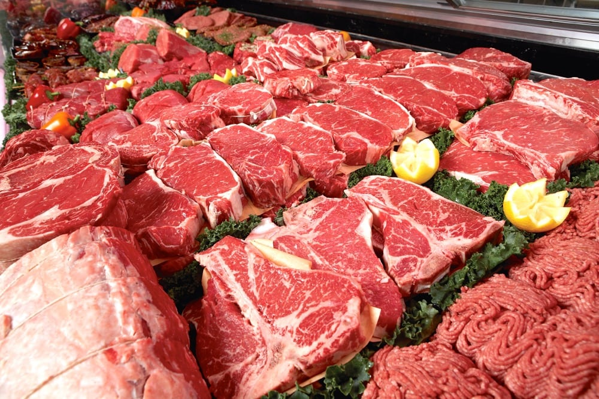

<style>
body {
text-align: justify;
font-size: 13pt;}
caption {
      color: black;
      font-weight: bold;
      font-size: 1.0em;
    }
</style>


```{r setup, include = FALSE}
knitr::opts_chunk$set(echo = TRUE, error = TRUE, warning= FALSE, message = FALSE, global.true=TRUE,
                      comment = '', fig.width = 15, fig.height = 10, out.width='750px' , fig.align='center')
```

```{r klippy, echo=FALSE, include=TRUE}
#remotes::install_github("rlesur/klippy")
klippy::klippy(position = c('top', 'right'))
```


# Synopsis

# Packages Required

This project aims to provide facts and figures of U.S. beef industry with R data wrangling, visualization and mapping functions and techniques.

* The most common functions in  ***tidyverse***, ***data.table***, ***ggplot2***, and ***usmap*** packages are employed. 
* The packages ***knitr*** and ***DT*** are used to provide customized plots, images and tables for R markdown output. 
* Animated plots and maps are produced with the packages ***gganimate***, ***gifski*** and ***png***. 

```{r packages}
#install.packages("...")
#data wrangling
library(tidyverse)
library(dtplyr)
library(tidyfast)
library(data.table)
#plots
library(ggplot2)
library(ggrepel)
library(cowplot)
#R interface/JavaScript-DataTables
library(knitr)
library(DT)
#load excel files
library(readxl)
#animated  plots
library(png)
library(gifski)
library(gganimate)
#mapping
library(usmap)
#rmarkdown
library(knitr)
#USDA data with API
library(tidyUSDA)
```

```{r}
#plot theme settings
plot_theme = theme(
  plot.title = element_text(face="bold", size = 20),
  axis.title.x = element_text(face="bold", size = 16),
  axis.text.x = element_text(face="bold",size = 14),
  axis.title.y = element_text(face="bold",size = 16),
  axis.text.y = element_text(face="bold",size = 14),
  strip.text.x = element_text(size=rel(3.5)),
  strip.text.y = element_text(size=rel(3.5)),
  legend.title = element_text(face="bold",size=16),
  legend.text = element_text(face="bold",size=14),
  )
```

# 1. Introduction

United States is the largest producer and consumer of beef in the world with 20% of the global beef production. The main stages of beef-cattle production process in U.S. are cow-calf operations, stocker/backgrounding operations, feedlots, meat packers and processors, and retailers. The production process begins with the cow-calf farms where cows and calves are raised. The next stage of production occurs at stocker/backgrounding operations where calves are placed on grass or other type of roughage. Feedlots are the final chain in the cattle production and they feed cattle with different rations of grain, silage, and/or protein supplements and sell to beef packers and processors where beef and beef by-products are produced and sold to retailers. The economic size of beef-cattle industry including direct and indirect economic contributions during on-farm and post-farm activities is estimated as $167 billion in 2016 [<a href="https://www.mdpi.com/2071-1050/14/8/4391/htm" target="_blank">1</a>]. 

This project presents facts and figures of the industry with 4 main variables: production, international trade, price, and consumption. Production, international trade, and price sections include both cattle and beef sectors' data. Consumption figures are per capita values and beef is compared with pork and chicken per capita consumption.


# 2. Data

## 2.1. Data Sources
<a href="https://quickstats.nass.usda.gov/" target="_blank">USDA National Agricultural Statistics Service</a> database is the data source of the project, unless stated otherwise.

## 2.2. Data Import

All data used in the project is provided at <a href="https://github.com/ErdalErol/US-Beef-Industry" target="_blank">github</a> repository of the project.

### 2.2.1. Production

#### Cattle

Beef cattle inventory data is used for cattle production section. National, state and county level data is obtained for years available in the database. 

* U.S. Beef Cattle Inventory: 1920-2022, January 1 Inventory Value of the Year.
```{r}
cattleinv_data_yearly =  read_csv("data/beef_cattle_inv_yearly.csv")
```

* U.S. Beef Cattle Inventory by States: 1920-2022, January 1 Inventory Value of the Year.
```{r}
cattleinv_data_state_year =  read_csv("data/beef_cattle_inv_state_year.csv")
```

* U.S. Beef Cattle Inventory by Counties: 2021, January 1.
```{r}
cattleinv_data_county =  read_csv("data/beef_cattle_inv_county_2021.csv")
```


#### Beef

Beef production values are yearly production amount (million pounds). 

* U.S. Beef Production: 1970-2021.
```{r}
beef_prod_data = read_excel("data/yearly beef production.xlsx")
```

### 2.2.2. International Trade 

Trade data is in quantities by partner countries across years. 

#### Cattle

* Export 

  + U.S. Cattle Exports: 1989-2021.
```{r}
export_data_cattle = read_excel("data/cattle_trade.xlsx", sheet = "export")
```

* Import 

  + U.S. Cattle Imports: 1989-2021.
```{r}
import_data_cattle = read_excel("data/cattle_trade.xlsx", sheet = "import")
```

#### Beef

* Export

  + U.S. Beef Exports: 1989-2021.  
```{r}
export_data <- read_excel("data/beef_trade.xlsx", sheet = "export")
```

* Import
  
  + U.S. Beef Imports: 1989-2021.  
```{r}
import_data <- read_excel("data/beef_trade.xlsx", sheet = "import")
```

### 2.2.3. Prices

#### Cattle
Cattle prices are monthly 'prices received' values for beef cattle, calves, cows and steers and heifers.  All prices are dollars per cwt (hundred pounds of weight). 

```{r}
cattle_price_data = read_excel("data/feedercattle_prices.xlsx")
```

#### Beef

Beef price dataset covers monthly farm, wholesale, and retail price data from period 1970 to 2021. All prices are in cents per pound. 

```{r}
beef_price_data = read_excel("data/beef_prices.xlsx")
```

### 2.2.4. Consumption

Consumption data is in per capita values. 

```{r}
beef_consmptn_data = read_excel("data/beef_consumption.xls")
```

# 3. Beef Industry

## 3.1. Production

### 3.1.1. Cattle

***National***

This project presents a macro picture of the industry with 4 main variables: production, international trade, price, and consumption. Production, international trade, and price sections include both cattle and beef sectors' data. Consumption figures are per capita values and beef is compared with pork and chicken per capita consumption.


<center>
<a href="https://unsplash.com/photos/1AKuVmQxUkU" target="_blank">{width=60%}<figcaption align="bottom"></a>Photo by David Dolenc</a></center>


This project presents a macro picture of the industry with 4 main variables: production, international trade, price, and consumption. Production, international trade, and price sections include both cattle and beef sectors' data. Consumption figures are per capita values and beef is compared with pork and chicken per capita consumption.


```{r}
table_data = as.data.table(cattleinv_data_yearly)
table_data %>%
  .[, Value:=Value/1000]%>%
  .[, pct_change := (Value/lead(Value) - 1)]%>%
  datatable(table_data,caption = htmltools::tags$caption(
    style = 'caption-side: top; text-align: center;', ('Table 1: U.S. Beef Cattle Inventory: 1920-2022')
  ), colnames = c('Year', '# of Heads-1000', 'Annual Change'))%>%
  formatCurrency('Value',currency = "", interval = 3, mark = ",", digits = 0)%>%
  formatPercentage('pct_change', 1)

```

This project presents a macro picture of the industry with 4 main variables: production, international trade, price, and consumption. Production, international trade, and price sections include both cattle and beef sectors' data. Consumption figures are per capita values and beef is compared with pork and chicken per capita consumption.


This project presents a macro picture of the industry with 4 main variables: production, international trade, price, and consumption. Production, international trade, and price sections include both cattle and beef sectors' data. Consumption figures are per capita values and beef is compared with pork and chicken per capita consumption.

```{r}
table_data[,pct_change := (Value/lead(Value) - 1)*100]
table_data = as.data.frame(table_data)

g1 = ggplot(table_data, aes(x = Year, y = Value)) + 
  labs(title = "a) U.S. Beef Cattle Inventory-1000 heads") +
  geom_line(color="orange") +
  theme_bw()+
  plot_theme

g2 = ggplot(table_data, aes(x = Year, y = `pct_change`)) + 
  labs(title = "b) U.S. Beef Cattle Inventory-% change") +
  geom_line(color="orange") +
  theme_bw()+
  plot_theme

plot_grid(g1, g2)
```

***State Level***

```{r}
table_data = as.data.table(cattleinv_data_state_year)
table_data %>%
  .[order(-Year)]%>% 
  .[, Value:=Value/1000]%>%
  .[, c("Year", "State","Value")] %>%
  datatable(table_data,caption = htmltools::tags$caption(
    style = 'caption-side: top; text-align: center;', ('Table 2: U.S. Beef Cattle Inventory by State: 1920-2022')
  ), colnames = c('Year', 'State', 'Value-1000 heads'))%>%
  formatCurrency('Value',currency = "", interval = 3, mark = ",", digits=0)

```


```{r}
table_data = as.data.table(cattleinv_data_state_year)
table_data %>%
  .[, c("Year", "State", "Value")] %>%
  .[order(-Value)]%>% 
  .[, Value:=Value/1000]%>%
  .[Year==2022] %>%
  .[, c("State","Value")] %>%
  .[, state_share := (Value/sum(Value))]%>%
  datatable(table_data,caption = htmltools::tags$caption(
    style = 'caption-side: top; text-align: center;', ('Table 3: U.S. Beef Cattle Inventory by State: 2022')
  ), colnames = c('State', '# of Heads-1000', 'State Share'))%>%
  formatCurrency('Value',currency = "", interval = 3, mark = ",", digits = 0)%>%
  formatPercentage('state_share', 1)

```


```{r}
state_map_data =table_data %>%
  .[, c("Year", "State", "Value")] %>%
  .[order(-Value)]%>% 
  .[, Value:=Value/1000]%>%
  .[Year==2022]

setnames(state_map_data,"State","state")

g1 = 
  plot_usmap(data = state_map_data, values = "Value", labels = TRUE,  color = "black")  + 
  scale_fill_continuous(name = "Beef Cattle Inventory",  low = "white", high = "red", label = scales::comma) + 
  labs(title = "U.S. Beef Cattle Inventory by State, 2022-1000 heads") +
  theme(plot.title = element_text(face="bold",size=20), legend.position = "right",  
        legend.title = element_text(face="bold",size=15), legend.text = element_text(size=12))

# Set label font size
g1$layers[[2]]$aes_params$size =5

g1

```
<center>
<a href="https://www.ars.usda.gov/oc/images/photos/oct17/d3858-1/" target="_blank">{width=50%}<figcaption align = "bottom"></a>Photo by David Augustine</a></center>


```{r}
table_data = as.data.table(cattleinv_data_state_year)
animated_map_data = table_data %>%
  .[, c("Year", "State", "Value")] %>%
  .[, Value:=Value/1000]%>%
  .[Year> 1972]
  
  
setnames(animated_map_data,  "State", "state")

# plot =
#   plot_usmap(data = animated_map_data, values = "Value", labels = FALSE)  +
#   scale_fill_continuous(name = "Beef Cattle Inventory",  low = "white", high = "red", label = scales::comma) +
#   labs(title = "Kentucky Beef Cattle Inventory by County, 2021-heads") +
#   theme(plot.title = element_text(face="bold",size=20), legend.position = "right",
#         legend.title = element_text(face="bold",size=15), legend.text = element_text(size=12))+
#    transition_states(Year)
# 
# animate(plot, fps = 5)

```

***County Level***

```{r}
table_data = as.data.table(cattleinv_data_county)
table_data %>%
  .[order(-Value)] %>%
  .[, c("State", "County","Value")] %>%
  datatable(table_data,caption = htmltools::tags$caption(
    style = 'caption-side: top; text-align: center;', ('Table 4: U.S. Beef Cattle Inventory by County- January 1, 2021')
  ), colnames = c('State','County','# of Heads'))%>%
  formatCurrency('Value',currency = "", interval = 3, mark = ",", digits = 0)

```


#### Kentucky

<center>
<a href="https://pixabay.com/photos/theatre-building-sign-kentucky-2703064/" target="_blank">{width=50%}<figcaption align="bottom"></a>Photo by Danehrr22</a></center>

```{r}
table_data = as.data.table(cattleinv_data_state_year)
table_data %>%
  .[, c("Year", "State", "Value")] %>%
  .[, Value:=Value/1000]%>%
   .[State=="KENTUCKY"] %>%
  .[, c("Year","Value")] %>%
  .[, pct_change := (Value/lead(Value) - 1)]%>%
  datatable(table_data,caption = htmltools::tags$caption(
    style = 'caption-side: top; text-align: center;', ('Table 3: Kentucky Beef Cattle Inventory by State: 1920-2022')
  ), colnames = c('Year', '# of Heads-1000', 'Annual Change'))%>%
  formatCurrency('Value',currency = "", interval = 3, mark = ",", digits = 0)%>%
  formatPercentage('pct_change', 1)

```

```{r}

```

This project presents a macro picture of the industry with 4 main variables: production, international trade, price, and consumption. Production, international trade, and price sections include both cattle and beef sectors' data. Consumption figures are per capita values and beef is compared with pork and chicken per capita consumption.

```{r}
table_data = table_data %>%
  .[, Value:=Value/1000]%>%
   .[State=="KENTUCKY"] %>%
  .[, c("Year","Value")]

#table_data =table_data[order(-year)]
table_data[, pct_change := (Value/lead(Value) - 1)*100]
table_data = as.data.frame(table_data)

g1 = ggplot(table_data, aes(x = Year, y = Value)) + 
  labs(title = "a) Kentucky Cattle Inventory-1000 heads") +
  geom_line(color="orange") +
  theme_bw()+
  plot_theme+
  annotate(
    geom = "curve", x = 1966, y = 1355, xend = 1975, yend = 1429, 
    curvature = -.3, arrow = arrow(length = unit(3, "mm")) )+
  annotate("text", y = 1350, x = 1955, label = "max: ~1.5 milion in 1975", size =5, angle = 0)

g2 = ggplot(table_data, aes(x = Year, y = `pct_change`)) + 
  labs(title = "b) Kentucky Beef Cattle Inventory-% change") +
  geom_line(color="orange") +
  theme_bw()+
  plot_theme

plot_grid(g1, g2)
```

***County Level***

```{r}
table_data = as.data.table(cattleinv_data_county)
table_data %>%
  .[order(-Value)] %>%
  .[State=="KENTUCKY"] %>%
  .[, c("County","Value")] %>%
  datatable(table_data,caption = htmltools::tags$caption(
    style = 'caption-side: top; text-align: center;', ('Table 5: Kentucky Beef Cattle Inventory by County- January 1, 2021')
  ), colnames = c('County','# of Heads'))%>%
  formatCurrency('Value',currency = "", interval = 3, mark = ",", digits = 0)
```

```{r}
ky_data = table_data %>%
  .[order(-Value)] %>%
  .[State=="KENTUCKY"] %>%
  .[, c("County","Value")]
  
setnames(ky_data,"County","county")
ky_fips = read_csv("data/fips_ky.csv")
ky_data_plot = merge(ky_data,ky_fips)

g1 = 
  plot_usmap(data = ky_data_plot, values = "Value", regions="county", 
             include = c("KY"),  labels = TRUE,  color = "black")  + 
  scale_fill_continuous(name = "Beef Cattle Inventory", 
                        low = "white", high = "cornflowerblue", label = scales::comma) + 
  labs(title = "Kentucky Beef Cattle Inventory by County, 2021-heads") +
  theme(plot.title = element_text(face="bold",size=20), legend.position = "right",  
        legend.title = element_text(face="bold",size=15), legend.text = element_text(size=12))

# Set label font size
g1$layers[[2]]$aes_params$size =3

g1
```

### 3.1.2. Beef

<center>
<a href="https://www.canadiancattlemen.ca/prime-cuts/tyson-leads-transparency-push-on-beef-production/" target="_blank">{width=50%}<figcaption align = "bottom"></a>Photo by Canada Beef Inc.</a></center>


```{r}
table_data = as.data.table(beef_prod_data[, -c(3:10), with=FALSE])
table_data %>%
  .[order(-year)]%>% 
  .[, pct_change := (production/lead(production) - 1)]%>%
  datatable(table_data,caption = htmltools::tags$caption(
    style = 'caption-side: top; text-align: center;', ('Table 6: U.S. Beef Production: 1970-2021')
  ), colnames = c('Year', 'Million pounds', 'Annual Change'))%>%
  formatCurrency('production',currency = "", interval = 3, mark = ",", digits = 0)%>%
  formatPercentage('pct_change', 1)
```

This project presents a macro picture of the industry with 4 main variables: production, international trade, price, and consumption. Production, international trade, and price sections include both cattle and beef sectors' data. Consumption figures are per capita values and beef is compared with pork and chicken per capita consumption.

```{r}
table_data =table_data[order(-year)]
table_data[, pct_change := (production/lead(production) - 1)*100]

g1 = ggplot(table_data, aes(x=year,y =production)) + 
  labs(title ="a) U.S. Beef Production-Million pounds")+
  geom_line(color="orange")+
  theme_bw()+
  plot_theme

g2 = ggplot(table_data, aes(x=year, y=pct_change))+ 
  labs(title ="b) U.S. Beef Production-% Annual Change")+
  geom_line(color="orange")+
  theme_bw()+
  plot_theme

plot_grid(g1, g2)
```


This project presents a macro picture of the industry with 4 main variables: production, international trade, price, and consumption. Production, international trade, and price sections include both cattle and beef sectors' data. Consumption figures are per capita values and beef is compared with pork and chicken per capita consumption.


## 3.2. International Trade
### 3.2.1. Cattle 

#### Export

```{r}
export_data_cattle = melt(export_data_cattle, id.vars ="country",
variable.name = "year", value.name = "export")

export_data_cattle = as.data.table(export_data_cattle, key="country")
export_data_cattle[, export:=export/1000]
```

```{r}
table_data = as.data.table(export_data_cattle)
table_data %>%
  datatable(table_data,caption = htmltools::tags$caption(
    style = 'caption-side: top; text-align: center;', ('Table 1: U.S. Beef Cattle Exports: 1989-2021')
  ), colnames = c('Country', '# Year', 'Value-'))%>%
  formatCurrency('export',currency = "", interval = 3, mark = ",", digits = 0)

```


```{r}
cattle_exports = export_data_cattle[year =="2021"]
setorderv(cattle_exports, cols="export",  order=-1L, na.last=TRUE)
```

```{r}
data= cattle_exports[2:111]
data= data[, c("year"):=NULL]

data[, export:=round(export*100/509.576, digits = 1)]
setnames(data,  "export", "export_share")

rest_total = sum(data$export[6:111], na.rm = T)  
rest_totw <- data.frame("restoftheworld", rest_total)      
names(rest_totw) = c("country", "export_share")

data= data[1:5]

data1 = rbind(data, rest_totw) 

table_data = setorderv(data1, cols="export_share",  order=-1L, na.last=TRUE)

knitr::kable(
  table_data[1:6],
  col.names = c('Country', 'Share-%'),
  align = "lccrr",
  caption = "Table 7: U.S. Cattle Exports by Country"
)
```

```{r}
#labels
data2 <- data1 %>% 
  mutate(csum = rev(cumsum(rev(export_share))), 
         pos = export_share/2 + lead(csum, 1),
         pos = if_else(is.na(pos), export_share/2, pos))

data2 = as.data.frame(data2)
ggplot(data1, aes(x = "" , y = export_share, fill=fct_inorder(country))) +
  labs(title = "U.S. Cattle Exports by Country")+
  geom_col(width = 1, color = 1) +
  coord_polar(theta = "y") +
  scale_fill_brewer(palette = "Pastel1") +
  geom_label_repel(data = data2,
                   aes(y = pos, label = paste0(export_share, "%")),
                   size = 4.5, nudge_x = 1, show.legend = FALSE) +
  guides(fill = guide_legend(title = "Country")) +
  theme_bw()+
  plot_theme
```

#### Import

```{r}
import_data_cattle = melt(import_data_cattle, id.vars ="country",
variable.name = "year", value.name = "import")

import_data_cattle = as.data.table(import_data_cattle, key = "country")

import_data_cattle[, import:=import/1000]
```

```{r}
table_data = as.data.table(import_data_cattle)
table_data %>%
  datatable(table_data,caption = htmltools::tags$caption(
    style = 'caption-side: top; text-align: center;', ('Table 1: U.S. Beef Cattle Imports: 1989-2021')
  ), colnames = c('Country', '# Year', 'Value-'))%>%
  formatCurrency('import',currency = "", interval = 3, mark = ",", digits = 0)

```

```{r}
cattle_imports = import_data_cattle[year =="2021" ]
setorderv(cattle_imports, cols="import",  order=-1L, na.last=TRUE)
```

```{r}
data= cattle_imports[2:24]
data= data[, c("year"):=NULL]

data[, import:=round(import*100/1775.492, digits = 1)]
setnames(data,  "import", "import_share")

rest_total = sum(data$import[3:24], na.rm = T)  
rest_totw <- data.frame("restoftheworld", rest_total)      
names(rest_totw) = c("country", "import_share")

data= data[1:2]

data1 = rbind(data, rest_totw) 
table_data = setorderv(data1, cols="import_share",  order=-1L, na.last=TRUE)
knitr::kable(
  table_data[1:3],
  col.names = c('Country', 'Share-%'),
  align = "lccrr",
  caption = "Table 8: U.S. Cattle Imports by Country"
)
```

```{r}
#labels
data2 <- data1 %>% 
  mutate(csum = rev(cumsum(rev(import_share))), 
         pos = import_share/2 + lead(csum, 1),
         pos = if_else(is.na(pos), import_share/2, pos))

data2 = as.data.frame(data2)
ggplot(data1, aes(x = "" , y = import_share, fill=fct_inorder(country))) +
  labs(title = "U.S. Cattle Imports by Country")+
  geom_col(width = 1, color = 1) +
  coord_polar(theta = "y") +
  scale_fill_brewer(palette = "Pastel1") +
  geom_label_repel(data = data2,
                   aes(y = pos, label = paste0(import_share, "%")),
                   size = 4.5, nudge_x = 1, show.legend = FALSE) +
  guides(fill = guide_legend(title = "Country")) +
  theme_bw()+ 
  plot_theme
```


#### Trade Balance

```{r}
cattle_trade_data = merge( export_data_cattle,import_data_cattle, by = c("country", "year"), all=T)
cattle_trade_data = cattle_trade_data[, trade_balance:= export-import] 
cattle_trade_data = cattle_trade_data[, us_status:= ifelse(trade_balance<0, "net_importer", "net_exporter")] 
total_cattle_trade = cattle_trade_data[country=="Total"]
setorder(total_cattle_trade, cols = -"year") 

table_data = as.data.table(total_cattle_trade)
table_data %>%
  .[, country:= NULL]%>%
  .[, trade_balance:=round(trade_balance, digits = 0)]%>%  
  datatable(table_data,caption = htmltools::tags$caption(
    style = 'caption-side: top; text-align: center;', ('Table 9: U.S. Cattle Trade-1000 heads')
  ), colnames = c('Year', 'Export', 'Import', 'Balance', 'Position'))%>%
  formatCurrency(c('export','import', 'trade_balance'), currency = "", interval = 3, mark = ",", digits=0)

```

### 3.2.2. Beef 

```{r}
dt = 
  beef_prod_data[, -c(3,5,7,8,9,10), with=FALSE] %>% 
  as.data.frame(dt)  %>%
  select(year, import, export) %>%
  gather(key = "variable", value = "value", -year)

ggplot(dt, aes(x = year, y = value)) + 
  labs(title = "U.S. Beef Trade-1000 lbs") +
  geom_line(aes(color = variable), size = 1) +
  scale_color_manual(values = c("orange", "lightblue")) +
  theme_bw()+ 
  plot_theme
```

#### Export

```{r}
export_data = melt(export_data, id.vars ="country",
variable.name = "year", value.name = "export")

export_data = as.data.table(export_data, key="country")
export_data[, export := export/1000]
```

```{r}
beef_exports = export_data[year =="2021"]
setorderv(beef_exports, cols="export",  order=-1L, na.last=TRUE)
```

```{r}
data= beef_exports[2:217]
data= data[, c("year"):=NULL]

data[, export:=round(export*100/3447.0693	, digits = 1)]
setnames(data,  "export", "export_share")

rest_total = sum(data$export[11:217], na.rm = T)
rest_totw <- data.frame("restoftheworld", rest_total)      
names(rest_totw) = c("country", "export_share")

data= data[1:10]

data1 = rbind(data, rest_totw) 
table_data = setorderv(data1, cols="export_share",  order=-1L, na.last=TRUE)
knitr::kable(
  table_data[1:11],
  col.names = c('Country', 'Share-%'),
  align = "lccrr",
  caption = "Table 10:U.S. Beef Exports by Country"
)

```

```{r}
#labels
data2 <- data1 %>% 
  mutate(csum = rev(cumsum(rev(export_share))), 
         pos = export_share/2 + lead(csum, 1),
         pos = if_else(is.na(pos), export_share/2, pos))

data2 = as.data.frame(data2)
ggplot(data1, aes(x = "" , y = export_share, fill=fct_inorder(country))) +
  labs(title = "U.S. Beef Exports Country Shares - %")+
  geom_col(width = 1, color = 1) +
  coord_polar(theta = "y") +
  scale_fill_brewer(palette = "Pastel1") +
  geom_label_repel(data = data2,
                   aes(y = pos, label = paste0(export_share, "%")),
                   size = 4.5, nudge_x = 1, show.legend = FALSE) +
  guides(fill = guide_legend(title = "Country")) +
  theme_bw()+
  plot_theme
```

#### Import

```{r}
import_data = melt(import_data, id.vars ="country",
variable.name = "year", value.name = "import")

import_data = as.data.table(import_data, key = "country")
import_data[, import:=import/1000]
```

```{r}
beef_imports = import_data[year =="2021"]
setorderv(beef_imports, cols="import",  order=-1L, na.last=TRUE)
```

```{r}
data= beef_imports[2:94]
data= data[, c("year"):=NULL]


data[, import:=round(import*100/3347.51555		, digits = 1)]
setnames(data,  "import", "import_share")

rest_total = sum(data$import[11:217], na.rm = T)
rest_totw <- data.frame("restoftheworld", rest_total)      
names(rest_totw) = c("country", "import_share")

data= data[1:10]
data1 = rbind(data, rest_totw) 

table_data = setorderv(data1, cols="import_share",  order=-1L, na.last=TRUE)
knitr::kable(
  table_data[1:11],
  col.names = c('Country', 'Share-%'),
  align = "lccrr",
  caption = "Table 11: U.S. Beef Imports by Country"
)
```

```{r}
#labels
data2 <- data1 %>% 
  mutate(csum = rev(cumsum(rev(import_share))), 
         pos = import_share/2 + lead(csum, 1),
         pos = if_else(is.na(pos), import_share/2, pos))

data2 = as.data.frame(data2)
ggplot(data1, aes(x = "" , y = import_share, fill=fct_inorder(country))) +
  labs(title = "U.S. Cattle Imports Country Shares - %")+
  geom_col(width = 1, color = 1) +
  coord_polar(theta = "y") +
  scale_fill_brewer(palette = "Pastel1") +
  geom_label_repel(data = data2,
                   aes(y = pos, label = paste0(import_share, "%")),
                   size = 4.5, nudge_x = 1, show.legend = FALSE) +
  guides(fill = guide_legend(title = "Country")) +
  theme_bw()+
  plot_theme
```

#### Trade Balance

```{r}
beef_trade_data = merge( export_data,import_data, by = c("country", "year"), all=T)
beef_trade_data = beef_trade_data[, trade_balance:= export-import] 
beef_trade_data = beef_trade_data[, us_status:= ifelse(trade_balance<0, "net_importer", "net_exporter")] 

beef_total_trade = beef_trade_data[country=="Total" ]
setorder(beef_total_trade, cols = -"year") 

table_data = as.data.table(beef_total_trade)
table_data %>%
  .[, country:= NULL]%>%
  datatable(table_data,caption = htmltools::tags$caption(
    style = 'caption-side: top; text-align: center;', ('Table 12: U.S. Beef Trade-1000 pounds')
  ), colnames = c('Year', 'Export', 'Import', 'Balance', 'Position'))%>%
  formatCurrency(c('export','import', 'trade_balance'), currency = "", interval = 3, mark = ",", digits=0)

```

## 3.3. Prices

### Cattle

```{r}

table_data = as.data.table(cattle_price_data)

table_data %>%
  .[order(-date)]%>% 
  .[, date:=as.character(date)] %>%
  datatable(table_data,caption = htmltools::tags$caption(
    style = 'caption-side: top; text-align: center;', ('Table 13: U.S. Cattle Prices- Dollars per cwt')
  ), colnames = c('Date','Beef Cattle','Calves', 'Cows','Steers/Heifers'))%>%
  formatCurrency(c('all_beef_cattle', 'calves', 'cows', 'steer_and_heifers'),currency = "", interval = 3, mark = ",", digits = 0)

```

```{r}
dt = 
  cattle_price_data %>% 
  as.data.frame(dt)  %>%
  select(date, all_beef_cattle, calves, cows, steer_and_heifers) %>%
  gather(key = "price", value = "value", -date)

ggplot(dt, aes(x = date, y = value)) + 
  labs(title = "U.S. Cattle Prices-Dollars per cwt") +
  geom_line(aes(color = price), size = 1) +
  scale_color_manual(values = c("orange", "lightblue", "lightgreen", "black")) +
  theme_bw()+
  plot_theme

```


### Beef
```{r}
table_data = as.data.table(beef_price_data[, -c(5:7)])
table_data %>%
  .[order(-date)]%>% 
  .[, date:=as.character(date)] %>%
  datatable(table_data,caption = htmltools::tags$caption(
    style = 'caption-side: top; text-align: center;', ('Table 13: U.S. Beef Prices- Cents per pound')
  ), colnames = c('Date', 'Farm','Wholesale','Retail'))%>%
  formatCurrency(c('farm','wholesale','retail'),currency = "", interval = 3, mark = ",", digits = 0)
```

```{r}
dt = 
  beef_price_data[, -c(5:7), with=FALSE] %>% 
  as.data.frame(dt)  %>%
  select(date, farm, wholesale, retail) %>%
  gather(key = "price", value = "value", -date)

ggplot(dt, aes(x = date, y = value)) + 
  labs(title = "U.S. Beef Prices-cents per pound") +
  geom_line(aes(color = price), size = 1) +
  scale_color_manual(values = c("orange", "lightblue", "lightgreen")) +
  theme_bw()+
  plot_theme
```


```{r}
table_data = as.data.table(beef_price_data[, -c(2:4)])
table_data %>%
  .[order(-date)]%>% 
  .[, date:=as.character(date)] %>%
  datatable(table_data,caption = htmltools::tags$caption(
    style = 'caption-side: top; text-align: center;', ('Table 14: U.S. Beef Price Spreads- Cents per pound')
  ), colnames = c('Date', 'Farm-Retail','Farm-Wholesale','Wholesale-Retail'))%>%
  formatCurrency(c('farm-retail','farm-wholesale','wholesale-retail'),currency = "", interval = 3, mark = ",", digits = 0)

```

```{r}
dt = 
  beef_price_data[, -c(2:4), with=FALSE] %>% 
  as.data.frame(dt)  %>%
  select(date, `farm-retail`, `farm-wholesale`, `wholesale-retail`) %>%
  gather(key = "spread", value = "value", -date)


ggplot(dt, aes(x = date, y = value)) + 
  labs(title = "U.S. Beef Price Spreads") +
  geom_line(aes(color = spread), size = 1) +
  scale_color_manual(values = c("orange", "lightblue", "lightgreen")) +
  theme_bw()+
  plot_theme
```

## 3.4. Consumption

<center>
<a href="https://unsplash.com/photos/dZ-HI4EuWcA" target="_blank">{width=50%}<figcaption align = "bottom"></a>Photo by Madie Hamilton</a></center>

```{r}
table_data = as.data.table(beef_prod_data[, c(1,9)])
table_data %>%
  .[order(-year)]%>% 
  .[, pct_change := (population/lead(population) - 1)]%>%
  datatable(table_data,caption = htmltools::tags$caption(
    style = 'caption-side: top; text-align: center;', ('Table 15: U.S. Popupation- Thousand')
  ), colnames = c('Year', 'Population','Annual Change'))%>%
  formatCurrency(c('population'),currency = "", interval = 3, mark = ",", digits = 0)%>%
  formatPercentage('pct_change', 1)

```

This project presents a macro picture of the industry with 4 main variables: production, international trade, price, and consumption. Production, international trade, and price sections include both cattle and beef sectors' data. Consumption figures are per capita values and beef is compared with pork and chicken per capita consumption.

```{r}
table_data[,pct_change := (population/lead(population)- 1)*100]
table_data = as.data.frame(table_data)

table_data[,pct_change := (population/lead(population) - 1)*100]
table_data = as.data.frame(table_data)
```

```{r}
g1 = ggplot(table_data, aes(x=year, y=population))+ 
  labs(title="a) U.S. Population-Thousand")+
  geom_line(color ="orange")+
  theme_bw()+
  plot_theme

g2 = ggplot(table_data, aes(x = year, y = pct_change))+ 
  labs(title = "b) U.S. Population - Annual Change-%")+
  geom_line(color = "orange")+
  theme_bw()+
  plot_theme

plot_grid(g1, g2)
```

```{r}
table_data[,pct_change :=(population/lag(population)-1)*100]

```

This project presents a macro picture of the industry with 4 main variables: production, international trade, price, and consumption. Production, international trade, and price sections include both cattle and beef sectors' data. Consumption figures are per capita values and beef is compared with pork and chicken per capita consumption.

```{r}
table_data = as.data.table(beef_consmptn_data)
table_data %>%
  .[order(-year)]%>% 
  datatable(table_data,caption = htmltools::tags$caption(
    style = 'caption-side: top; text-align: center;', ('Table 16: U.S. Meat Consumption - per capita- pound')
  ), colnames = c('Year', 'Beef','Pork','Chicken'))%>%
  formatCurrency(c('beef','pork','chicken'),currency = "", interval = 3, mark = ",", digits = 0)

```


```{r}

dt = 
  as.data.frame(beef_consmptn_data)  %>%
  select(year, beef, pork, chicken) %>%
  gather(key = "per capita consumption", value = "value", -year)

ggplot(dt, aes(x = year, y = value)) + 
  labs(title = "U.S. Meat Consumption-pounds") +
  geom_line(aes(color = `per capita consumption`), size = 1) +
  scale_color_manual(values = c("orange", "lightblue", "lightgreen")) +
  theme_bw()+
  plot_theme
```


```{r}

dt = 
  as.data.frame(beef_consmptn_data)  %>%
  select(year, beef, pork, chicken) %>%
  gather(key = "per capita consumption", value = "value", -year)

# ggplot(dt, aes(x = year, y = value)) +
#   labs(title = "U.S. Meat Consumption-pounds") +
#   geom_line(aes(color = `per capita consumption`), size = 1) +
#   scale_color_manual(values = c("orange", "lightblue", "lightgreen")) +
#   theme_bw()+
#   transition_reveal(year)

```


# 4. Summary


# Contact

* Webpage: <a href="https://erdalerol.weebly.com/" target="_blank">erdalerol.weebly.com</a> 

* Github: <a href="https://github.com/ErdalErol" target="_blank">@ErdalErol</a> 

  
  
